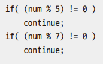

# Chapter06 제어문
***

## 1. 조건문

### 1.1 if문


> - x가 1보다 크면 중괄호 안의 내용을 실행한다
>   - 사람의 생각
> - x > 1을 비교 연산한다. 그리고 if문은 조건식의 결과가 true이면 중괄호의 내용을 실행한다
>   - 컴퓨터의 동작 순서

<br>

#### 예제: Ex01_If

> - if문의 중괄호 안의 실행 문이 이렇게 한 문장밖에 없다면 중괄호를 생략할 수 있다.
> ```
> if(num < 50)
> System.out.println(num);
> System.out.println("num 변수의 값이 50보다 작습니다.");
> ```
> - 이 if문은 중괄호가 없기 때문에 한 줄만 실행 영역으로 판단한다.

<br>

### 1.2 switch문

> - switch문을 사용하면 많은 선택지를 가지는 분기 처리를 할 수 있다.
> - 조건식의 결과와 일치하는 case문에 작성된 문장을 실행한다.
> - 조건식의 값이 어떤 case와도 맞지 않으면 default로 넘어가게 된다.
> - 각 case의 마지막에는 break문을 사용해서 선택한 처리만을 실행할 수 있다.


#### 예제: Ex02_Switch

> - switch문의 조건식에는 이렇게 연산식을 넣어줄 수도 있고 그냥 변수만 넣어줄 수도 있다.

<br>

#### 1.2.1 break문 생략하기

#### 예제: Ex03_SwitchNoneBreak

> - break문을 없애 여러 값을 묶어서 처리할 수 있다.
> - break는 반복문과 switch문에서만 사용할 수 있다.
>   - 실행 흐름을 중단시키고 해당 중괄호 밖으로 빠져나간다.

<br>

#### 1.2.2 조건식에 스트링 사용하기

#### 예제: Ex04_SwitchString

<br>
<br>

## 2. 반복문

### 2.1 for문

#### 예제: Ex05_For

<br>

#### 2.1.1 for문 요소의 생략, 응용

> - for문을 구성하는 요소는 상황에 따라 생략할 수 있다.

#### 예제: Ex06_ForExtention

<br>

### 2.2 while문

> - while문은 반복의 횟수보다는 처리 조건이 정해졌을 때, for문은 반복의 횟수가 정해져 있는 때 사용하면 좋다.

#### 예제: Ex07_While



> ```
> if(((num % 5 ) != 0) || (num % 7) != 0)
> continue;
> ```
> 이와 같이 바꿀 수 있다.

<br>

### 2.3 do~while문

> - do~while문도 while문과 똑같이 반복 처리를 실행하는 제어문이다.
> - while문은 조건식을 평가하기 때문에, 첫 번째 반복이 돌 때 조건식의 결과가 false면 wwhile문 중괄호 안의 문장들이 한 번도 수행되지 않을 수 있다.
> - 그에 반해 do~while문은 조건식을 아래쪽에 쓰기 때문에 최소 한 번은 중괄호 안의 문장들이 실행된다.

#### 예제: Ex08_DoWhile

> - while의 조건식을 검사하는 소괄호 뒤에 세미콜론 ;이 없으면 에러가 발생하는 경우가 많으니 조심해야 한다.

<br>

### 2.4 레이블을 이용한 중첩된 반복문의 일괄 중지

> - 여러 개의 중첩된 반복문에서는 코드 실행 중간에 break문을 만나면 가장 가까운 반복문을 빠져 나간다.
> - 안쪽 반복문에서 바깥쪽의 모든 반복문까지 중지하고 싶을 때 레이블을 이용한 반복문의 중지기능을 사용하면 된다.

#### 예제: Ex09_BreakLabel