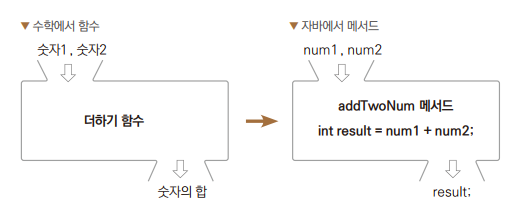
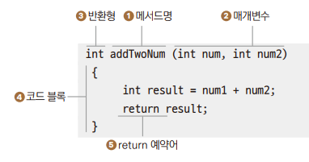
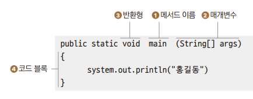
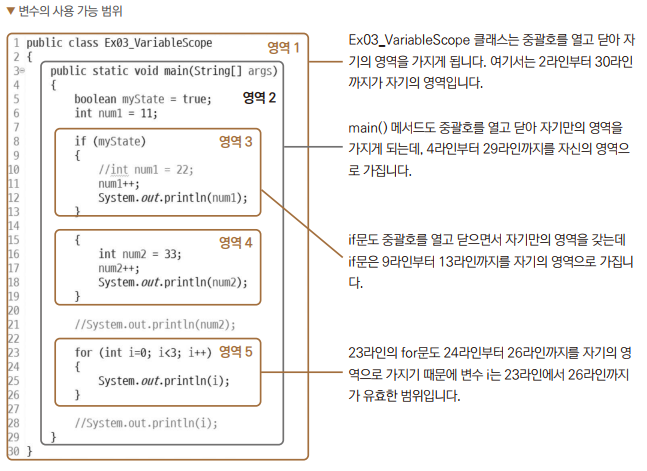
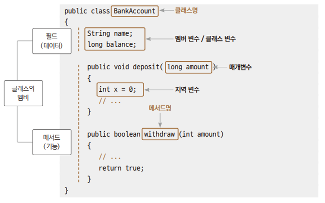

# Chapter07 메서드와 변수의 사용 가능 범위

## 1. 메서드 정의



> 다음은 더하기 기능을 구현해 놓은 메서드이다.
> 이렇게 기능을 구현하는 것을 '메서드를 정의한다'라고 한다.



> 1. 메서드명
> - 더하기 기능을 수행하는 코드 블록의 이름
> - 카멜 표기법을 사용하되 첫 글자를 소문자로 한다.
>
> 2. 매개변수(Parameter)
> - 메서드에 전달되는 입력값
> - 메서드 바깥의 값을 메서드 안으로 전달시켜준다고 해서 매개변수라고 부른다.
> - 개수 제한은 따로 없다.
>   - 매개변수가 없을 수도 있다.
> - 단, 메서드를 호출할 때 지정한 개수대로 매개변수의 값을 입력해야 한다.
>
> 3. 반환형
> - 메서드에서 처리한 기능의 결과
> - 반환하는 자료형에 따라 int, long, String 등을 적어주면 된다.
> - 반환값이 없을 수도 있다.
>   - 메서드의 반환형으로 void라고 표시
> - 매개변수는 여러 개일 수 있지만 반환형은 무조건 하나다.
> 
> 4. 코드 블록
> - 코드블록이 실행되면서 더하기 기능을 수행한다.
>
> 5. return
> - 반환값
> - 3번의 반환형과 자료형이 같아야 한다.
> - void로 지정해서 반환하는 값이 없다면 return을 사용하지 않는다



> - main() 또한 메서드이다.
> - 메서드에서 다른 메서드의 기능을 사용하려고 코드에 메서드를 적어주는 것을 '메서드 호출'이라고 한다.

### 예제: Ex01_MethodType

> - main() 메서드에는 static이 붙어있기 때문에 main() 메서드에서 호출하는 메서드에는 다 static이 붙어있다.

<br>

## 2. 메서드 종료

### 예제: Ex02_ReturnForExit

> ```return;```
> - 반복문, switch문에서 사용한 break는 해당 문장의 중괄호를 빠져 나오지만 return은 메서드를 종료시킨다.

<br>

## 3. 변수의 사용 가능 범위

> - 자바에서 변수는 사용할 수 있는 범위에 따라 클래스 변수, 지역 변수, 매개변수 등으로 구분할 수 있다.
> - 같은 영역에는 같은 이름의 변수가 존재할 수 없다.
> - 포함이 된 작은 영역 쪽에서 포함시킨 큰 영역 쪽의 변수는 사용할 수 있지만, 반대로는 안 된다.

### 예제: Ex03_VariableScope



> - 영역 1 : 기숙사
>   - 영역 2 : 1동, 2동, 3동
>       - 영역 3 : (1동)101호
>       - 영역 4 : (1동)102호
>       - 영역 5 : (1동)103호

<br>

## 정리

