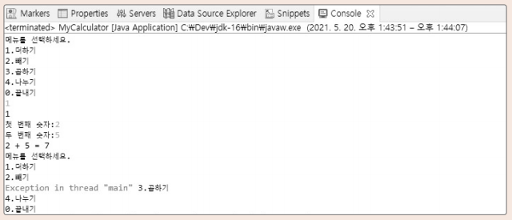

# Chapter08 계산기 만들기

## 1. 프로젝트 목적
> 해당 프로젝트는 앞서 학습했던 Java 언어로 구현하여 간단한 계산기를 만드는 것이다.

### 프로젝트 예시

 
 

## 2. 프로젝트 의의
>자료형과 메서드의 사용을 공부할 수 있었다.

 

## 3. 프로젝트 구성
> - 예제1: ch08_Calculator
> - 예제2: ch08_Calculator_Ver2

## 4. 마치며
> 예제1는 앞에서 배웠던 학습내용을 기반하여 계산기를 만들었다.
> 
> 예제2는 정수 외의 예외처리를 위하여 try~catch 사용과 nextLine()을 사용해 Scanner 초기화를 하였다.
> 
>  
> 간단한 계산기 예제를 만들면서 가독성과 효율을 생각하며 만들었고, 복습하는 시간을 갖게 되었다.
