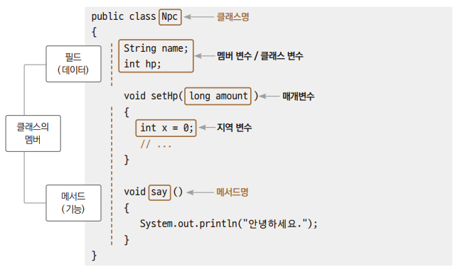
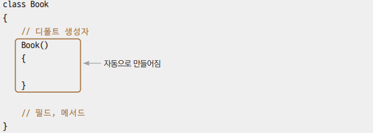
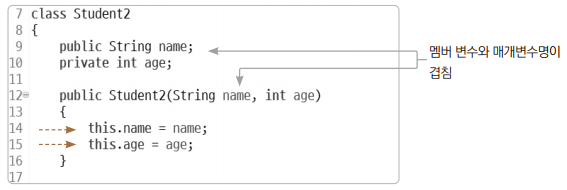

# Chapter09 클래스
***

## 1. 객체
> 우리가 표현할 수 있는 실제 세계의 모든 사물들을 객체(Object)라고 한다.

| 개념적인 객체 | 물리적인 객체    |
|---|------------|
| 동물 | 개,호랑이, 고양이 |
| 자동차 | 소나타, K5, SM5 |

<br>
<br>

## 2. 클래스
> - 클래스란 간단히 말하면 프로그래밍에서 객체와 관련된 데이터와 처리 동작을 한데 모은 코드뭉치이다.
> 
> - 추상화란 특징적인 데이터와 처리 동작을 추려내는 과정이다.
>   - 현실 객체를 프로그래밍에서 전부 묘사하기에는 데이터와 처리 동작이 너무 많기 때문에 필요하다.

<table>
    <tr style="font-weight: bold">
        <td>객체</td>
        <td>목적 구분</td>
        <td>객체 구분</td>
        <td>추상화된 클래스 모델</td>
    </tr>
    <tr>
        <td rowspan="3">탈 것</td>
        <td>개인, 이륜</td>
        <td>자전거, 오토바이</td>
        <td>Bike</td>
    </tr>
    <tr>
        <td>자동차</td>
        <td>승용차, 버스, 트럭</td>
        <td>Car</td>
    </tr>
    <tr>
        <td>운송 수단</td>
        <td>자동차, 배, 비행기</td>
        <td>Vehicle</td>
    </tr>
</table>

> 추상화 모델이 결정되고 객체를 추상화(일반화)할 때 다음과 같은 추상화 작업을 거치게 된다.
> - 명사적인 특징을 뽑아내는 추상화 과정 ▶ 멤버 변수(필드) 추출
> - 동사적인 특징을 뽑아내는 추상화 과정 ▶ 멤버 함수(메서드) 추출

```
// 클래스 정의: 객체를 추상화해놓은 것
class Npc{
    // 필드: 데이터
    String name;
    int hp;

    // 메서드: 동작
    void say(){
        System.out.println("안녕하세요");
    }
}
```
> 이렇게 어떤 객체를 자바의 클래스 파일에 데이터는 필드로, 동작은 메서드로 추상화해서 기술하는 것을 '클래스를 정의한다'라고 한다.



<br>
<br>

## 3. 객체와 클래스

> 실체화된 것을 객체(오브젝트)라고 하며, 실체화하는 작업을 '객체(오브젝트)를 생성한다'또는 '인스턴스화한다'등으로 말한다.

| | 설계도 | | 객체 생성(인스턴스화) | | 실물 |
|-|-|-|-|-|-|
| 실생활 | 자동차 설계도 | → | 공장 | → | (생산된)자동차 |
| 프로그래밍 | 클래스 | → | new | → | (메모리에 적재된)값 |

```
 Book  book =   new     Book();
클래스  변수   객체생성  생성자
```
> - myBook이라는 변수를 만드는 데 변수의 자료형을 Book이라는 클래스형으로 한다.
> - Book 클래스의 Book()생성자를 이용해서 new해서 생성된 객체를 메모리에 적재하고 변수 myBook에 대입한다.

<br>

```
   int      num   =    5;
기본 자료형  변수   상수 풀에서 복사
```
> - num이라는 변수를 만드는 데 변수의 자료형을 기본 자료형인 int형으로 한다.
> - 상수 풀에서 5를 복사해서 변수 num에 대입시킨다.

<br>

### 예제: Ex01_NpcUse
```
class Npc{

    String name;
    int hp;

    void say(){
        System.out.println("안녕하세요.");
    }
}
```
> - Npc 클래스를 정의한다.
> - Npc 클래스에서 데이터로 사용할 것, 즉 필드를 정의한다.
> - Npc 클래스에서 기능으로 사용할 것, 즉 메서드를 정의한다.

<br>

> - .java파일이 하나이더라도 작성한 클래스 개수만큼 .class파일이 생성된다.
> - 이렇게 만들어진 객체들은 설계도만 같지 각각 만들어져 서로 다른 메모리에 저장된다.
> - 객체 생성에는 new 연산자를 사용한다.
> - 다른 객체 멤버에는 .(dot)을 이용하여 접근한다.

<br>
<br>

## 4. 오버로딩
> 오버로딩(Overloading)이란 하나의 클래스 내에 매개변수 개수나 자료형은 다르지만 메서드 명은 같은 메서드 여러 개를 정의하는 것이다.
> - 동일하거나 유사한 일을 수행하는 메서드가 전달받는 매개변수에 따라 각기 다른 연산을 하는 경우 유용하다.

### 예제: Ex02_OverloadingUse
> 자바에서는 메서드명과 매개변수까지 합쳐서 메서드를 구분한다.

```
System.out.println(); // 매개변수 없이 줄바꿈만 출력
System.out.println(1); // 정숫값 출력
System.out.println("임정빈"); // 문자열 출력
```
> 이것도 오버로딩이 적용된 메서드이다.

<br>
<br>

## 5. 생성자
> 생성자(Constructor)란 객체 생성을 할 때만 호출하는 특수한 메서드이다.
```
  Book    myBook =   new    Book();
클래스타입   변수  객체 생성  생성자
```
> - 생성자명은 클래스명하고 똑같다.
> - 메서드이지만 반환형이 없는 형태다.



> - 클래스를 정의할 때 생성자를 기술하지 않으면 매개변수가 없는 생성자가 자동으로 만들어지는데, 이것을 디폴트 생성자라고 한다.
> - 프로그래머가 굳이 정의하지 않아도 컴파일러가 자동으로 만들어주기 때문에 보통 생략하고 만드는 경우가 많다.

<br>

### 예제: Ex03_ConstructorUse
> 생성자의 매개변수로 값을 넘겨 생성되는 객체의 멤버 변수의 값을 초기화할 수 있다.

> - 매개변수가 있는 생성자를 오버로딩해서 만들면 디폴트 생성자가 만들어지지 않는다.
> - 생성자를 오버로딩해서 만들고, 디폴트 생성자를 만들지 않았을 때, 디폴트 생성자로 객체를 생성할 때 에러가 발생한다.

<br>
<br>

## 6. 접근 제한자
| 접근 제한자 | 설명 |
|--|--|
| public | 외부 클래스 어디에서나 접근 가능하다. |
| protected | 같은 패키지(폴더)내부와 상속 관계의 클래스에서만 접근 가능하다. |
| default(생략시) | 같은 패키지 내부에서만 접근 가능하다. |
| private | 같은 클래스 내부에서만 접근 가능하다. |

> 이렇게 private를 적용하면 클래스 외부에서 클래스 내부로의 변수와 메서드에 대한 접근을 제한할 수 있다.
> - 이러한 것을 객체지향 프로그래밍에서 정보 은닉화(Information Hiding)라고 한다.

### 예제: Ex04_PrivateUse

```
public int getAge(){ // 게터
        return age;
    }

public void setAge(int age){ // 세터
    this.age = age;
}
```
> - private 멤버 변수에 값을 가져오는 메서드를 게터(getter), 값을 대입하는 메서드를 세터(setter)라고 한다.
> - getter and setter를 통해 변수에 접근하는 이유는 값 대입 시 부적절한 값의 대입을 막기 위함이다.



> - 멤버 변수임을 구분하기 위해 this를 사용한다.

<br>
<hr>

## 출처
이재환의 자바 프로그래밍 입문