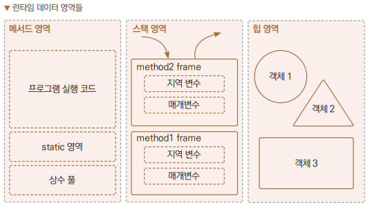
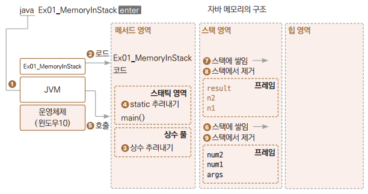
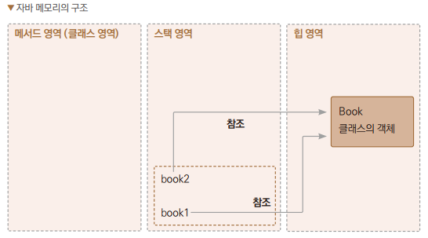

# Chapter10 자바의 메모리 모델

## 1. 자바의 메모리 모델

> - java.exe가 실행되면서 자바 가상 머신이 만들어진다.
> - 이때 자바는 메모리 공간 활용의 효율성을 높이기 위해 메모리 공간을 여러 영역으로 나누게 됩니다.
>   - 메서드 영역, 스택 영역, 힙 영역



### 1.1 메소드 영역
> - 프로그램 실행에 대한 코드, 스태틱 변수 및 메서드, 런타임 상수 풀이 메서드 영역에 생성된다.
> - 이 영역에 저장된 내용은 프로그램 시작 전에 로드되고 프로그램 종료 시 소멸된다.
> - 상수 풀에는 컴파일 타임에 알려진 숫자 리터럴부터 런타임에 확인되어야 하는 메서드 및 필드 참조에 이르기까지 여러 종류의 상수가 포함된다.

<br>

### 1.2 스택 영역
> - 메서드가 호출되면 지역 변수, 매개변수가 프레임 형태로 생성되어 스택 영역으로 쌓였다 가 사라진다.
> - 프레임 영역을 벗어난 다른 메서드의 변수들은 서로 참조할 수 없다.

<br>

### 1.3 힙 영역
> - 클래스의 객체, 배열이 new 연산자에 의해 힙 영역에 동적으로 생성된다.
> - 생성된 객체는 자동 저장소 관리 시스템인 가비지 컬렉터에 의해 사용이 없음이 확인되면 자동으로 제거된다.
> - C / C++와 달리 자바에서는 이렇게 자동으로 메모리 관리를 해준다.

<br>
<br>

## 2. 스택 영역 원리
### 예제: Ex01_MemoryInStack



> 1. 코드가 메서드 영역에 다 로딩이 되면 그중에서 스태틱으로 지정된 변수와 메서드를 찾아 메서드 영역 내 스태틱 영역으로 옮겨준다.
>    - main() 메서드는 static 지시자가 붙어 있기 때문에 스태틱 영역에 위치하게 된다.
>       - 이때 스태틱 변수가 있다면 값이 여기서 대입된다.
>       - 아직 프로그램이 시작하기 전
> 2. JVM은 무조건 메서드 영역 내 스태틱 영역에서 main() 메서드를 첫 메서드로 실행 시킨다.
>    - 만약 스태틱 영역에 옮겨진 main()이 없다면 프로그램은 실행되지 않는다.
>      - 그래서 실행시키려고 JVM에 전달한 클래스에는 main ()메서드가 반드시 있어야 하고 public으로 접근 가능해야 한다.

<br>

### 2.1 스태틱(Static)
> - 먼저 추려내져야 하는 변수와 메서드가 있다면 static 지시자 표시를 하여 메모리의 특정 영역에 따로, 그리고 미리 로딩시켜놓은 것이다.
> - 이 영역의 변수 및 메서드는 어떤 객체에서도 접근해서 사용할 수 있다.
>   - 그렇기에 스태틱 변수를 전역 변수라고 부르기도 한다.

<br>
<br>

## 3. 힙 영역 원리
### 예제: Ex02_MemoryInHeap1, Book

```
Book book1 = new Book();
Book book2 = new Book();
```
| id | class     | 힙 위치 |
|----|-----------|-|
| 20 | String[0] | 0x ~~~~~~~~~~~ (메모리 주소)|
| 27 | Book      | 0x ~~~~~~~~~~~ (메모리 주소)|

> - new 연산자와 생성자를 이용하여 객체를 힙 영역에 만든다.
>   - 객체를 참조할 수 있게 객체를 관리하는 내부적인 표에 자기 위치를 등록시켜준다.
> - 생성되는 객체 크기는 클래스마다 천차만별이라 힙 영역에 동적으로 만들어 저장한다.

> - book1 변수는 스택 영역에 만들어진다.
> - 값으로는 크기가 천차만별인 객체를 직접 대입받지 않고 그 객체를 참조할 수 있는 id값을 대입받는다.
>   - 그래서 참조 변수라고도 한다.
> - id값은 정해진 크기의 값이기 때문에 스택 영역에 변수의 값으로 대입할 수 있다.
> - book1과 book2가 참조하는 id값은 다르다.

<br>

```
book1 = null;
```

> - null을 대입하는 것을 참조를 끊는다고 한다.
>   - 스택 영역의 변수와 힙 영역의 객체 간에 참조 관계를 끊는다.
> - 참조를 끊을 때 힙 영역의 객체가 바로 사라지는 것은 아니다.
> - 가비지 컬렉터가 메모리 관리를 위해 수행될 때 힙의 객체를 발견하고 이 객체를 사용하는 스택 영역의 변수를 찾아보고 아무것도 참조하는 것이 없다고 결론이 나면 그때 자동으로 제거를 하기 위해 제거 표시를 해준다 (제거가 아니고 제거 표시 ).
<br>

### 3.1 가비지 컬렉션(Garbage Collection)
> - 가비지 컬렉션이 수행되는 동안에는 모든 스레드가 멈추게 된다.
>   - 그래서 가비지 컬렉션의 실행 타이밍은 시스템의 성능에 영향을 미치지 않도록 별도의 알고리즘으로 계산되어 실행된다.
>     - 그러므로 가비지 컬렉션은 한 번도 발생하지 않을 수 있다.
>
>> ```System.gc()```
>> 
>>가비지 컬렉션을 강제로 발생시키는 코드
> - 가비지 컬렉션이 발생하면, 소멸 대상이 되는 인스턴스는 결정되지만 곧바로 실제 소멸로 이어지지는 않는다.
> - 그리고 인스턴스의 실제 소멸로 이어지지 않은 상태에서도 프로그램 이 종료될 수 있다.
>   - 종료가 되면 어차피 객체는 운영체제에 의해 소멸됩니다.
>> ```System.runFinalization();```
>>
>> 따라서 반드시 객체의 소멸을 이끄려면 finalize() 메서드가 추가로 삽입해야 한다.
>
> 단점
> - 프로그래머가 객체가 필요 없어지는 시점을 알더라도 메모리 에서 직접 해제할 수 없고, 가비지 컬렉션의 알고리즘이 메모리 해제 시점을 계속 추적하고 판단하게 되므로 추가적인 시스템 비용이 발생하게 된다.
> - 가비지 컬렉션이 실행되는 시각이나 수행 시간을 알 수 없다.
>   - 이런 점은 실시간 시스템 에서 프로그램이 예측 불가능하게 잠시라도 정지할 수 있어 매우 위험하다.
>
>> 그래서 위의 메서드들은 가급적 호출하지 않는 프로그램을 작성해야 합니다.

<br>
<br>

## 4. 힙 영역 객체 참조
### 예제: Ch10_Ex03_MemoryInHeap2, Book

```
Book book1 = new Book();
Book book2 = book1;
```
> - book1의 id값은 힙 영역에 만들어진 객체가 메모리의 어느 위치에 있다를 가리키고 있는 참조 값이다.
> - book2에도 book1이 참조하고 있던 기존 객체의 id값이 똑같이 들어와 있다.
> - 대입 연산은 연산의 결과, 상수 또는 기존 변수의 값을 새로운 변수의 값으로 넣어주는 것이므로, 지금도 book2 변수에 book1 변수의 값이 대입이 되고 그 값은 기존 객체를 참조할 수 있는 id값이다.
>> 결과적으로 힙 영역에 객체를 새로 만드는 것이 아니고, 기존 객체를 가리키는 변수만 하나 더 늘어난 것이다.



<br>
<hr>

## 출처
이재환의 자바 프로그래밍 입문