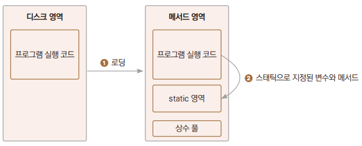
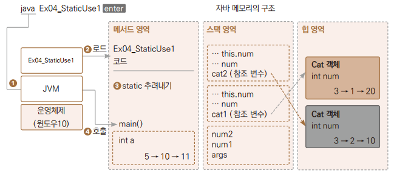

# Chapter11 스태틱

## 1. 스태틱

> 스태틱 변수 및 스태틱 메서드는 메서드 영역에 저장되며, 프로그램 시작 전에 로드되고 프로그램 종료 시 소멸된다.



> - 먼저 추려내져야 하는 변수와 메서드가 있다면 static 예약어 표시를 하여 메모리의 특정 영역에 따로, 그리고 미리 로딩을 시켜놓는것 뿐이다.
> - 스태틱 변수(정적 변수)는 값이 메모리에 로딩될 때 대입되고 블록이 있다면 메모리에 로딩될 때 실행된다.
>   - 메서드는 누가 호출해줘야 실행이 되는 것이기 때문에 로딩만 된다.

<br>
<br>

## 2. 전역 변수로 사용

> 메서드 영역 내 스태틱 영역의 변수 및 메서드는 어떤 객체에서도 접근해서 사용할 수 있다.

### 예제: Ex01_GlobalVariable

```
class Cat {
    static int a = 5;
    int num = 3;
    }
}
```

```
Cat cat1 = new Cat();
Cat cat2 = new Cat();
```
> - Cat 클래스형의 cat1 변수를 스택 영역에 생성한다.
> - Cat 클래스형의 객체를 힙 영역에 생성한다.
> - 멤버 변수 a는 static 예약어가 붙어 있으므로 여기서 만들지 않고 프로그램 시작 전에 미리 만들어져 있다.
> - cat1,cat2 변수에 생성된 객체를 참조할 수 있는 id값을 대입한다.
>   - cat2.a를 바꾸어도 cat1.a의 값이 바뀐다.



<br>
<br>

## 3. main()보다 먼저 실행

### 예제: Ex02_Preload

```
static int num;

    static {
        Random rand = new Random();
        num = rand.nextInt(100);
    }
```
> static으로 지정한 영역이기 때문에 프로그램 실행 전에 미리 로드가 되고 랜덤 객체를 만든다.

<br>

### 3.1 스태틱의 단점
> - 사용하는 메모리의 정확한 크기 계산을 하지 않더라도 힙 영역을 사용하지 않고 메서드 영역 의 일부분만 사용하므로 메모리 사용이 비효율적이다.
> - 한 객체가 가지고 있는 데이터들은 외부에서 함부로 접근하여 수정할 수 없도록 해야 한다는 객체지향 프로그래밍 원칙에 위배됩니다.
>   - 원칙: 캡슐화, 정보 은닉

<br>
<br>

## 4. 유틸 메서드로 사용

> - 스태틱 메서드는 유틸리티 성격의 프로그램에서 많이 사용한다.
>   - 특정 기능이 필요한데 자주 사용한다면 많은 클래스에서 중복되어 만들어지지 않게 하려는 의도이다.

### 예제: Ex03_UtilMethod
```
Ch11_MyCalculator calc1 = new Ch11_MyCalculator();
```
> - 객체가 만들어지기는 했지만 프로그램이 실행되기 이전에 이미 메서드 영역 내 스태틱 영역에 로드가 되어 있다.
>   - 낭비적인 작업

> - 스태틱을 메서드에 붙여주면 이렇게 객체 생성 없이 **클래스명.메서드명** 형식으로 유틸 메서드를 사용할 수 있다.
>   - static이 붙은 변수를 클래스 변수, 메서드를 클래스 메서드라고도 부른다.

<br>

```System.out.println```
> - System은 클래스다.
>   - 객체를 만들지 않고 바로 클래스명으로 접근해 사용했으므로 out에는 static이 붙어 있다라는 것을 알 수 있다.
> - out은 메서드의 특징인 소괄호()가 없으므로 메서드가 아니라 멤버 변수다.
>> System 클래스의 멤버 변수 out은 객체를 참조하고 있고, 그 참조한 객체의 println() 메서드를 이용해 출력 기능을 제공하고 있다.

<br>

```
import java.lang.System; // 자동 삽입
import java.util.Scanner; // 수동 삽입
```