# Chapter12 상속

## 1. 상속

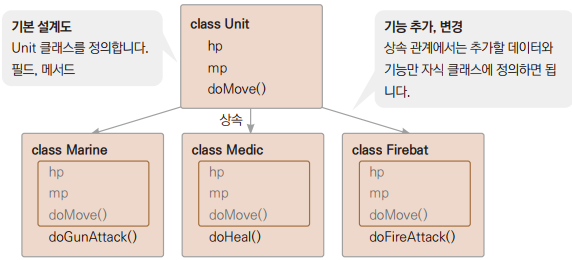

> 클래스가 가지고 있는 멤버를 다른 클래스에게 계승하는 것
> - 상속한 멤버는 자식 클래스에서 정의하지 않아도 사용할 수가 있으며, 자식 클래스 내에서 멤버를 추가로 정의해서도 사용할 수 있다.

<br>

### 1.1 상속의 장점

> - 클래스 간의 전체 계층 구조를 파악하기 쉽다.
> - 재사용성 증대: 기존 클래스에 있는 것을 재사용할 수 있다.
> - 확장 용이: 새로운 클래스, 데이터, 메서드를 추가하기가 쉽다.
> - 유지보수 용이: 데이터와 메서드를 변경할 때 상위에 있는 것만 수정하여 전체적인 일관성을 유지할 수 있다.

| 상속 대상 클래스 호칭        | | 상속을 받은 클래스 호칭       |
|---------------------|-|---------------------|
| 슈퍼 클래스(Super Class) | ↔ | 서브 클래스(Sub Class)   |
| 부모 클래스(Parent Class) | ↔ | 자식 클래스(Child Class) |
| 기반 클래스              | ↔ | 파생 클래스              |
| 조상 클래스 | ↔ | 자손 클래스              |
| 상위 클래스 | ↔ | 하위 클래스              |

### 예제: Ex01_MyTerran

```
class Unit{ // 부모 클래스
    String name;
    int hp;

    void printUnit(){
        System.out.println("이름: " + name);
        System.out.println("Hp: " + hp);
    }
}

class Marine extends Unit { // 자식 클래스
    int attack;

    void printMarine() {
        printUnit();
        System.out.println("공격력: " + attack);
    }
}
```

> name과 hp는 Marine 클래스에서는 볼 수 없지만 상속받은 Unit 클래스에 정의된 멤버 변수이기 때문에 Marine 클래스의 객체에서도 사용할 수 있다.

<br>

### 1.2 자바와 다중 상속
> 자바는 여러 클래스를 동시에 상속하는 다중 상속을 지원하지 않는다.

<br>
<br>

## 2. 오버라이딩

> 오버라이딩(Overriding)이란 상속된 메서드와 동일한 이름, 동일한 매개변수를 가지는 메서드를 정의하여 메서드를 덮어쓰는 것이다.
> - 반환값의 형도 같아야 한다.

<br>

### 2.1 오버라이딩의 목적

> - 상속받은 부모 클래스 메서드의 기능 변경
> - 상속받은 부모 클래스 메서드의 기능 추가

### 예제: Ex02_MyTerran2

```
class Marine2 extends Unit2 { // 자식클래스
    int attack;

    void doMove(){ // 상속받은 클래스의 기능 추가
        super.doMove(); // 부모 메서드 호출
        System.out.println(attack + " 공격");
    }
}

class Medic2 extends Unit2 { // 자식클래스
    int heal;

    void doMove(){ // 상속받은 클래스의 기능 변경
        System.out.println("이동속도 8으로 이동");
        System.out.println(heal + " 치유");
    }
}
```
> 부모 클래스의 doMove()와 자식 클래스의 doMove() 메서드가 헷갈리므로 부모에서 상속받은 메서드는 super 예약어를 이용하여 구분해서 불러줄 수 있게 한다.

<br>
<br>

## 3. 상속이 제한되는 final

```
final int MAX_NUM = 100;

final class Marine{

}
```
> final은 필드나 메서드, 클래스에 붙이는 예약어이다.

<br>

### 3.1 final 위치별 의미

| 사용 위치 | 설명                                 |
|-|------------------------------------|
| 변수 | final 변수는 상수를 의미한다.                |
| 메서드 | final 메서드는 하위 클래스에서 오버라이딩을 할 수 없다. |
| 클래스 | final 클래스는 상속을 할 수 없다.             |

> 클래스의 일부 메서드를 상속 제한하려면 메서드에 접근 제한자 private를 사용한다.

<br>
<br>

## 4. 추상 클래스
> - 구체적인 처리 내용을 기술하지 않고, 호출하는 방법만을 정의한 메서드를 추상 메서드라고 한다.
> - 추상 메서드를 가진 클래스를 추상 클래스라고 한다.
```
// 구상 메서드
public int adder(int n1, int n2)
{
    return n1 + n2;
}

// 추상 메서드
abstract public int adder(int n1, int n2)
```

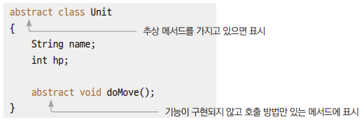

> - 추상 클래스는 객체를 생성할 수 없다.
> - 추상 클래스의 사용 이유는 상속받은 클래스의 기능을 미리 지정하기 위해서이다.

### 예제: Ex03_MyStarcraft

<br>
<br>

## 5. 인터페이스
> 인터페이스란 상속 관계가 아닌 클래스에 기능을 제공하는 구조이다.
> - 추상 클래스처럼 추상 메서드로 기능을 제공한다.

<br>

### 5.1 인터페이스 구현

> 추상클래스

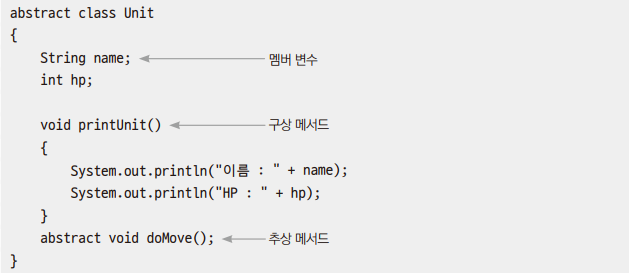

> 인터페이스

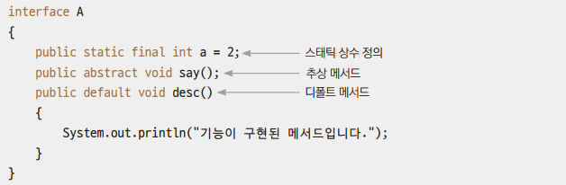

> 다음과 같이 사용 가능

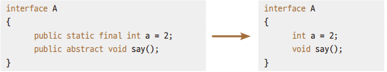

<br>

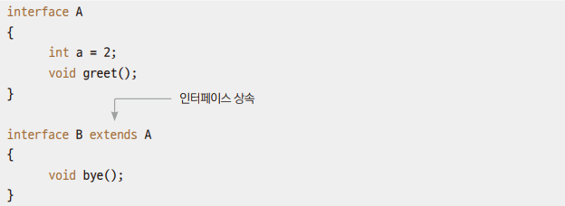

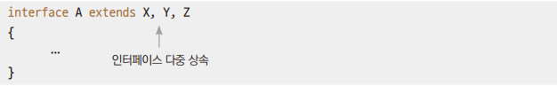

> - 인터페이스끼리 상속도 가능하며, 인터페이스가 일반 클래스를 상속할 수는 없다.
> - 인터페이스에 한해서 다중 상속도 된다.

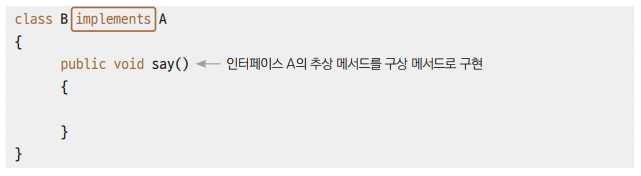

> - 클래스의 상속은 extends 예약어 사용
> - 인터페이스의 구현은 implements 예약어 사용
> - 인터페이스는 한 번에 여러 개를 구현할 수도 있다.
> - 상속은 다중 상속이 불가능하지만 인터페이스는 다중 구현이 가능하다.

```
class B exntends A implements X, Y, Z {

}
```
> 상속과 인터페이스를 동시에 사용한다면 앞에서 먼저 상속 표시를 해주고, 뒤에서 인터페이스를 필요한 만큼 표시한다.

#### 예제: Ex04_Meet

<br>

### 5.2 인터페이스와 추상 클래스의 차이

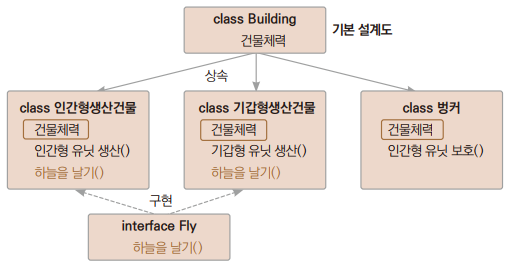

> - 상속을 통해 코드의 중복을 막고 코드의 재사용성을 높인다.
> - 클래스 간의 상속 관계를 통해 건물이라는 본질을 유지하게 하려면 추상 클래스를 통한 상속 기능을 사용하고, 단지 기능만을 구현하려면 인터페이스를 사용한다.

#### 예제: Ex05_Starcraft

<br>

### 5.3 디폴트 메서드

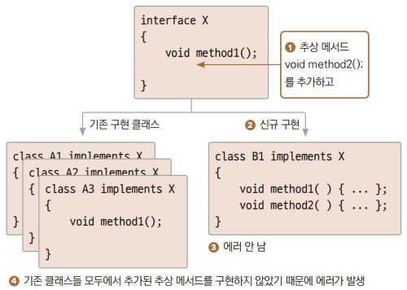

> - 어떤 인터페이스를 구현한 클래스가 이미 사용되고 있는 상태에서 새로운 클래스가 그 인터페이스를 구현하면서 기능이 부족해서 기능을 추가하려고 한다.
> - 그러면 기존에 그 인터페이스를 사용하던 모든 클래스에 추가된 기능을 구현해야하는 불편함이 있다.

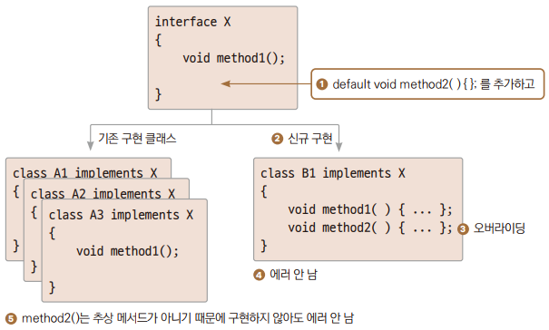

> - 상속을 사용하면 해결할 수는 있지만 같은 이름을 사용하고, 관리하고 싶을 때 디폴트 메서드를 사용한다.
> - 디폴트 메서드는 ③번에서 오버라이딩으로 다시 구현할 것이므로 ①번에서 구체적인 기능 구현 없이 중괄호만 사용해도 된다.

<br>
<br>

