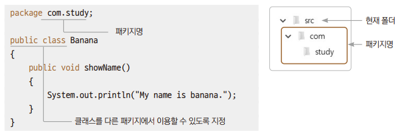

# Chapter13 패키지와 클래스 패스

## 1. 클래스 패스

### 1.1 자바 가상 머신이 클래스를 실행시키는 방법

> 1. 같은 폴더에서 클래스 파일을 찾아서 실행해준다.
> 2. 경로를 지정했다면 그 경로에 있는 클래스 파일을 찾아서 실행해준다.
> - 경로 지정은 클래스 패스를 이용할 수 있다.
> - 경로 지정은 패키지를 이용할 수 있다.
> 3. 같은 폴더나 지정된 경로에서 클래스 파일을 찾지 못했다면 클래스 패스에 지정된 폴더에서 찾아서 실행해준다.

### 예제: Apple, Ex01_ClassPath

<br>
<br>

## 2. 패키지

> 자바에서 패키지(Package는 관련이 있는 클래스를 묶어 폴더로 구분하여 관리하는 기법이다.
> - 한 폴더에서 클래스 파일이 많아지면 클래스명이 충도할 수 있는데, 충돌을 방지하는 가장 효과적인 방법은 폴더를 나누어 관리하는 것이다.



### 예제: com.study.Banana, Ex02_PackageUse

<br>
<br>

## 3. 패키지로 문제 해결

### 예제: com.company.area.Circle, com.company.circumference.Circle, Ex03_CircleUsing

```
com.company.area.Circle c1 = new com.company.area.Circle(3.5);
```
> - 이렇게 패키지를 이용하여 물리적인 폴더를 구분하여 저장하고 사용하면 서로 충돌이 발생하지 않게 된다.
> - 대신 패키지명.클래스명으로 코드가 길어지는 사소한 단점이 있다.

<br>
<br>

## 4. 임포트

### 예제: Ex04_ImportUse

```
import com.study.*
```
> - 임포트할 클래스가 많을 때는 이렇게 하나씩 임포트하는 것이 불편하기 때문에 다음과 같이 작성하면 같은 패키지에 있는 클래스를 한 번에 임포트할 수 있다.
> - 컴파일 과정을 거치면서 실제로 사용되는 것만 임포트된다.

<br>
<br>

## 5. 자바에서 기본 제공하는 패키지와 클래스
> - java.lang 패키지만 예외적으로 임포트가 필요 없다.
>   - 이 패키지에 포함된 String 클래스도 별도의 임포트 작업 없이 사용할 수 있다.
> - 자바가 제공하는 기본 패키지는 java로 시작하며, 확장 패키지는 javax로 시작한다.

> 자주 사용하는 자바의 기본 패키지

| 패키지명      | 패키지에 포함된 클래스                 |
|-----------|------------------------------|
| java.lang | 기본적인 클래스                     |
| java.io   | 입출력 관련 클래스                   
| java.net  | 네트워크 관련 클래스                  |
| java.util | 유틸리티 관련 클래스                  |
| java.math | 수치 연산 관련 클래스                 |
| java.text | 텍스트, 숫자, 날짜 등의 국제화 관련 클래스    |
| java.time | 자바 8이 지원하는 날짜 및 시간을 처리하는 클래스 |

<br>
<hr>

## 출처
이재환의 자바 프로그래밍 입문