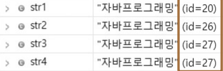
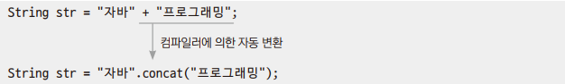
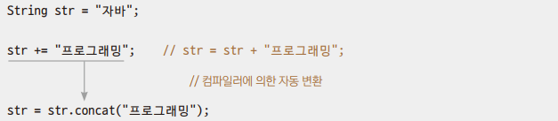
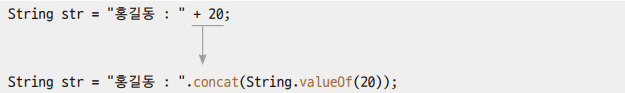
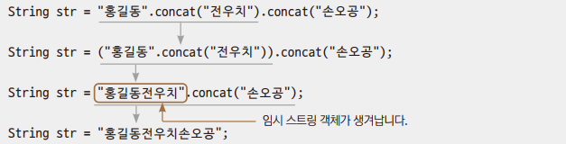

# Chapter14 String

## 1. String을 선언하는 두 가지 방법

| 구분 | 자료형 | 기호 | 예시                                 |
|-|-|-|------------------------------------|
| 문자 | char | 작은따옴표 사용 | 'A', '가', '0', ...                 |
| 문자열 | String | 큰따옴표 사용 | "A", "가", "0", "임정빈", "안녕하세요", ... |

```
String str1 = new String("임정빈");
```
> new 연산자와 문자열 리터럴 매개변수가 있는 생성자를 이용하여 객체를 힙에 만들고 그 참조 값을 변수에 대입한다.
> - 객체를 무조건 새로 만든다.

```
String str2 = "임정빈";
```
> 문자열 리터럴을 직접 대입한다.
> - 상수를 직접 대입할 수 없기 때문에 내부적으로 new String()을 호출하여 객체를 힙에 생성하고 그 참조 값을 변수에 대입한다.
> - 매번 새로 만드는 것이 아니고 똑같은 문자열 리터럴로 이미 만들어져 있는 객체가 있다면 그 객체의 참조 값을 변수에 대입한다.

### 예제: Ex01_StringUse

```
String str1 = new String("자바프로그래밍");
String str2 = new String("자바프로그래밍");
String str3 = "자바프로그래밍";
String str4 = "자바프로그래밍";
```
> - str1과 str2에 담긴 객체의 참조 값은 서로 다르다.
> - 문자열 리터럴을 직접 대입 받은 str3도 처음에는 객체를 내부적으로 new를 이용하여 만들게 된다.
> - 그 후 새로 만들어진 str4에도 문자열 리터럴이 직접 대입된다.
>   - 이미 같은 문자열을 사용하는 객체가 있으므로 그 객체의 참조 값을 str4에 대입한다.



<br>
<br>

## 2. 문자열형 변수의 참조 비교

### 예제: Ex02_RefCompare

> '==' 로는 문자열의 내용을 비교할 수 없다.
> - 참조 값 비교

<br>
<br>

## 3. 문자열형 변수의 내용 비교

### 예제: Ex03_ContentsCompare

```
String str1 = new String("Apple");
String str2 = new String("apple");
String str3 = new String("Banana");
```
> - str1, str2, str3은 문자열 리터럴이 다르기 때문이 아니고 new에 의해서 만들어졌기 때문에 서로 다른 객체다.
> - equals()는 객체의 참조 id를 비교하는 것이 아니라 객체 안에 들어있는 문자열의 내용을 비교한다.
> - compareTo()는 사전순으로 비교한다.
>   - A.compareTo(B)
>   - 값이 0이면 동일한 값
>   - 값이 음수이면 A가 사전순으로 앞쪽
>   - 값이 양수이면 B가 사전순으로 앞쪽

<br>
<br>

## 4. String 클래스의 메서드

### 4.1 문자열 합치기

#### 예제: Ex04_Concat

```
str1.concat(str2);
```
> - str1의 문자열에 str2 문자열을 합쳐서 새로운 문자열로 반환해준다.
> - 문자열 리터럴에 메서드를 바로 사용할 수도 있다.

<br>

### 4.2 문자열에서 문자 찾기

#### 예제: Ex05_IndexOf

```
str.indexOf("a");
```
> - a가 처음 나오는 위치를 찾아온다.
> - 대소문자 구분한다.

```
str.indexOf("a", 5);
```
> - str 문자열에서 5번째 위치부터 a를 찾아서 위치를 반환한다.

<br>

### 4.3 문자열 자르기

#### 예제: Ex06_Substring

```
str.substring(5, 11)
```
> str 문자열에서 5번째부터 10번째까지 문자열을 반환한다.

```
str.substring(5)
```
> str 문자열에서 5번째부터 끝까지 문자열을 반환한다.

<br>

### 4.4 문자열의 길이 구하기

#### 예제: Ex07_length

```
str.length()
```
> str 문자열의 길이를 구해온다.

```
str.charAt(i)
```
> - str 문자열에서 i번째 문자를 가져온다.
> - 반환 타입은 char

### 4.5 기본 자료형의 값을 문자열로 바꾸기

```
String.valueOf(b)
```
> boolean, char, double, float, int 등 자료형을 문자열로 바꿀 수 있다.

### 4.6 자주 사용되는 String 클래스의 메서드들

| 메서드 | 설명                       |
|-|--------------------------|
| boolean contains(String s) | 문자열 s를 포함하는지 조사한다.       |
| boolean startsWith(String s) | 시작하는 문자열이 s인지 조사한다.      |
| boolean endsWith(String s) | 끝나는 문자열이 s인지 조사한다.       |
| boolean isEmpty() | 문자열의 길이가 0이면 true를 반환한다. |
| String toLowerCase() | 문자열을 모두 소문자로 변환한다.       |
| String toUpperCase() | 문자열을 모두 대문자로 변환한다. |
| String trim() | 문자열 앞뒤에 있는 공백을 제거한 후 반환한다. |

<br>
<br>

## 5. 문자열 대상 연산

### 5.1 문자열 대상 +연산

> '문자열 + 문자열'에서 +는 산술 연산을 수행할 수 없기 때문에 컴파일러에 의해 자동 변환이 일어나서 String 클래스의 concat() 메서드가 수행된다.



<br>

### 5.2 문자열 대상 += 연산



<br>

### 5.3 문자열과 기본 자료형의 +연산





<br>
<br>

## 6. 문자열 결합

> String 클래스는 한 번 생성되면 그 내부의 문자열이 변경되지 않기 때문에 String 클래스를 사용해 문자열을 계속 연결하거나 변경하는 프로그램을 작성하면 메모리가 많이 낭비된다.

> - StringBuilder 클래스는 내부에 변경 가능한 변수를 가지고 있다.
>   - 이 클래스를 사용하여 문자열을 연결하면 기존에 사용하던 변수의 값을 계속 확장하므로 임시 객체를 만들지 않는다.
>     - 새로운 메모리를 확보하고 객체를 만드는 작업을 하지 않으므로 문자열 연결 속도도 빨라진다.

### 예제: Ex08_StringBuilder

```
StringBuilder buf = new StringBuilder("동해물과");
```
> StringBuilder 객체를 만들어 변수에 참조 값을 대입한다.

```
System.out.println(buf.toString());
```
> 출력하려면 스트링형으로 변환해서 출력해야 한다.

<br>

### 6.1 StringBuilder와 StringBuffer 클래스

> - 둘 다 내부에 변경 가능한 char[]를 변수로 가지고 있다.
> - 이 두 클래스를 사용하여 문자열을 연결하면 기존에 사용하던 char[] 배열이 확장되므로 임시 객체를 만들지 않는다.
> - 기능적으로 완전히 동일하다.
>   - 생성자를 포함한 메서드 수
>   - 메서드 기능
>   - 메서드 이름과 매개변수 선언

> - StringBuffer는 스레드에 안전하지만 모든 프로그램이 스레드 기능을 사용한 프로그래밍을 하지는 않는다.
> - 스레드 안전성이 불필요한 상황에서 StringBuffer를 사용하면 성능의 저하만 유발하게 된다.
>   - 그래서 StringBuilder가 등장하게 된 것뿐이다.

<br>
<br>

## 7. 문자열 분할

```
StringTokenizer st = new StringTokenizer("동해물과,백두산이,마르고,닳도록", ",");
```
> - StringTokenizer는 문자열을 분할하는 클래스다.
>   - 분할한 문자열을 토큰이라고 한다.
> - 첫 번째 매개변수: 데이터로 사용될 문자열
> - 두 번째 매개변수: 어떤 구분자를 이용해서 자를 것인지를 결정한다.
>   - 생략하면 공백이나 탭으로 구분한다.

### 7.1 StringTokenizer 클래스의 메서드
<table>
    <tr>
        <td>
            hasMoreTokens();
        </td>
        <td>
            토큰이 있으면 true를 반환한다.
        </td>
    </tr>
    <tr>
        <td>
            nextToken();
        </td>
        <td>
            토큰을 차례대로 가져온다.
        </td>
    </tr>
</table>

### 예제: Ex09_StringTokenizer
