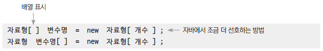
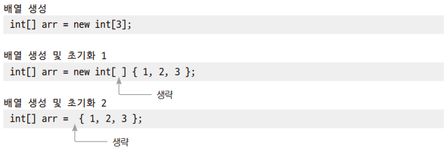
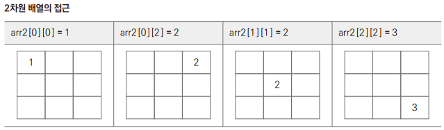
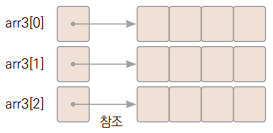
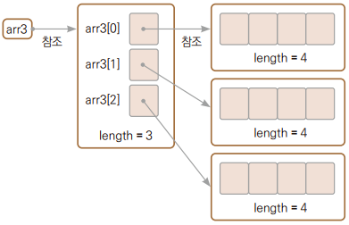
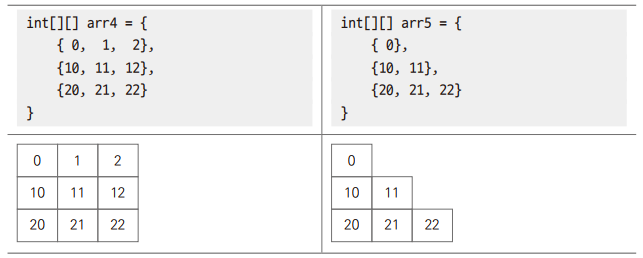

# Chapter15 배열

## 1. 1차원 배열

> 배열은 동일한 자료형 여러 개의 값을 함께 저장할 수 있다.

### 1.1 배열 선언

```
int score01 = 90;
int score02 = 85;
int score03 = 80;
...
int score50 = 0;
```

> - 프로그래밍을 하다 보면 자료형이 같은 자료를 여러 개 반복해서 구현해야 하는 일이 생긴다.
> - 그러나 변수 선언이 너무 많고 비효율 적이므로 배열을 사용해야 한다.

<br>



> 배열 변수는 기본 자료형을 사용하더라도 다음과 같이 객체를 만드는 방법으로 선언한다.

```
int[] korScore = new int[50];
```

> int형 데이터 50개를 저장할 공간을 힙에 만들고 korScore는 해당 공간을 가리킨다.

<table>
    <tr>
        <td>
            int num = 0;
        </td>
        <td>
            int[ ] num = new int[10];
        </td>
    </tr>
    <tr>
        <td>
            int num;<br>
            num = 0;
        </td>
        <td>
            int num;<br>
            num = new int[10];
        </td>
    </tr>
</table>

> 일반 변수처럼 변수 먼저 선언하고 나중에 대입을 시켜줄 수도 있다.

#### 예제: Ex01_ArrayInstance

<br>

### 1.2 배열 사용: 기본 자료형

#### 예제: Ex02_IntArray

<br>

### 1.3 배열 사용: String형

#### 예제: Ex03_StringArray

<br>

### 1.4 배열 사용: 클래스형

#### 예제: Ex04_BoxArray

<br>

### 1.5 배열 사용: 매개변수, 반환형

#### 예제: Ex05_ArrayInMethod

> 배열을 인수로 넘겨줄 수 있다.
> - 배열 전체를 가리키기 때문에 이름만 사용한다.

<br>

### 1.6 배열 생성과 동시에 초기화



> - 자바 컴파일러가 유추할 수 있는 부분은 생략이 가능하다.
> - 배열의 값을 초기화하지 않았을 때도 디폴트 초기화는 진행된다.
>   - 기본 자료형은 모든 요소를 0으로 초기화되고, 객체 배열(참조 변수 배열)은 모든 요소가 null로 초기화 된다.

#### 예제: Ex06_AarrayInit

<br>

### 1.7 main() 메서드의 매개변수

> - main() 메서드는 개발자가 직접 호출하는 메서드가 아니고 JVM이 프로그램을 실행할 때 불리는 메서드다.
> - 메서드를 호출해 인수를 넘겨주는 방식이 아니고 '명령 프롬프트'에서 프로그램을 실행할 때 인수를 넘겨주거나 IDE에서 매개변수로 사용할 데이터를 입력해야 한다.

<br>
<br>

## 2. for ~ each문

### 예제: Ex08_EnhancedFor

```
for(int e: arr){
    System.out.print(e + " ");
}
```
> 배열에서 배열의 요소 하나씩을 자동으로 꺼내주면서 반복이 실행된다.

### 예제: Ex09_EnhancedForObject

<br>
<br>

## 3. 다차원 배열

> 다차원 배열은 2차원, 3차원 배열 등으로 만들 수 있다.

### 3.1 2차원 배열



#### 예제: Ex10_ForInFor

<br>

### 3.2 2차원 배열의 실제 구조

```
int[][] arr3 = new int[3][4];
```







> 자바에서는 다음과 같은 초기화가 가능하다.(C 언어와는 다른 부분)

#### 예제: Ex11_PartiallyFilled

<br>
<br>

## 4. 배열 관련 유틸리티 메서드

### 4.1 배열의 초기화 메서드

> java.util.Array 클래스에 정의되어 있는 메서드

```
public static void fill(int[] a, int val)
// 두 번째 매개변수로 전달된 값으로 배열 초기화

public static void fill(int[] a, int fromIndex, int toIndex, int val)
// 인덱스 fromIndex ~ (toIndex - 1) 범위까지 val값으로 배열 초기화
```

<br>

### 4.2 배열의 복사 Array 클래스

> java.util.Array 클래스에 정의되어 있는 메서드

```
public static copyOf(int[] original, int newLength)
// original에 전달된 배열을 첫 번째 요소부터 newLength 길이만큼 복사

public static copyOfRange(int[] original, int from, int to)
// original에 전달된 배열을 인덱스 from부터 to 이전 요소까지 복사
```

> java.util.System 클래스에 정의되어 있는 메서드

```
public static void arraycopy(Object src, int srcPos, Object dest, int destPos)
// 배열 src의 srcPos에서 배열 dest의 destPos로 length 길이만큼 복사
```

<br>

#### 예제: Ex12_ArrayCopy

```
int[] arr1 = new int[10];
Arrays.fill(arr1, 3);

결과: 3 3 3 3 3 3 3 3 3 3 3
```
> Array 클래스의 스태틱 메서드인 fill() 메서드를 이용하여 지정한 값으로 배열을 채워줄 수 있다.

```
int[] arr2 = new int[8];
System.arraycopy(arr1, 0, arr2, 3, 4);

결과: 0 0 0 3 3 3 3 0
```
> System 클래스의 스태틱 메서드인 arraycopy() 메서드를 이용하여 기존에 만들어진 배열에 부분 복사를 할 수 있다.

```
int[] arr3 = Arrays.copyOfRange(arr2, 2, 5);

결과: 0 3 3
```
> Array 클래스의 스태틱 메서드인 copyOfRange() 메서드가 배열에서 부분 복사하여 반환한 객체르 배열에 대입할 수 있다.

> - System.arraycopy()는 기존에 만들어진 배열에 복사한 값을 넣어준다.
> - Arrays.copyOfRange()는 배열에 부분 복사한 값을 이용하여 배열 객체를 만들어 반환하고 배열 변수에 대입을 한다.

<br>

### 4.3 배열 내용 비교

#### 예제: Ex13_ArrayEquals

```
Array.equals(int[] arr1, int[] arr2)
```
> - Array클래스의 equals()는 배열을 비교해준다.
> - 두 배열에 저장된 데이터의 수, 순서 그리고 내용이 같을 때 true를 반환한다.
>   - 배열 길이가 다르면 false

<br>

### 4.4 배열의 내용 정렬

#### 예제: Ex14_ArraySort

```
public static void sort(int[] a)
```
> 매개변수 a로 전달된 배열을 오름차순으로 정렬

