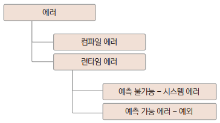
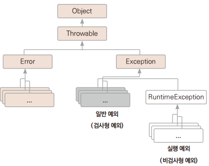
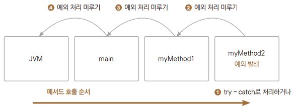

# Chapter16 예외 처리

## 1. 예외와 에러



> 에러는 컴파일 에러와 런타임 에러가 발생한다.

> - 컴파일 에러
>   - 컴파일시 에러가 발생하며 개발 환경에서 대부분 처리된다.
> - 런타임 에러
>   - 컴파일 시에는 에러가 발생하지 않았지만 실행 중에 에러가 발생한다.
>   - ex) 나누는 수를 0으로 입력한 경우

<br>

> 예측 가능하거나 불가능한 런타임 에러

> - 시스템 에러
>   - 사용 가능한 메모리가 부족하다거나, 운영체제에서 발생한 에러로 프로그램이 영향을 받게 되는 경우
>   - 개발자가 프로그램을 제어할 수 없다.
> - 예외(Exception)
>   - 예측 가능한 런타임 에러
>   - 다음과 같은 목적을 위해 제어하고 처리한다
>     - 프로그램의 정상 종료
>     - 예외 발생 시 무시하고 프로그램 계속 실행
>   - 프로그램에서 처리하는 예외 클래스의 최상위 클래스는 Exception클래스이다.
>     - 모든 예외 타입은 클래스로서 서로 상속 관계이다.



<br>
<br>

## 2. 예외 종류

> - 실행 예외
>   - 예외 처리를 하지 않아도 컴파일 할 수 있는 비검사형 예외(unchecked exception)
>   - 실행 단계에서 체크
> - 일반 예외
>   - 예외 처리를 하지 않으면 컴파일 오류가 발생하므로 꼭 처리해야 하는 검사형 예외(checked exception)
>   - 컴파일 단계에서 체크

> 예외를 구분하는 이유는 프로그램 성능 때문이다
> - 일반 예외는 컴파일러가 확실히 확인
> - 실행 예외는 개발자가 판단하여 예외를 처리하든지 처리가 안 되었다면 자바 가상 머신에 처리를 맡기게 된다.
>   - 자바 가상 머신에 처리를 맡기면 에러 내용을 보여주고 프로그램이 종료된다.

| 실행 예외 | 발생 이유 |
|-|-|
| ArithmeticException | 0으로 나누기와 같은 부적절한 산술 연산을 수행할 때 발생한다. |
| IllegalArgumentException | 메서드에 부적절한 매개변수를 전달할 때 발생한다. |
| IndexOutOfBoundException | 배열, 벡터 등에서 범위를 벗어난 인덱스를 사용할 때 발생한다. |
| NoSuchElementException | 요구한 원소가 없을 때 발생한다. |
| NullPointerException | null값을 가진 참조 변수에 접근할 때 발생한다. |
| NumberFormatException | 숫자로 바꿀 수 없는 문자열을 숫자로 변환하려 할 때 발생한다. |

| 일반 예외 | 발생 이유 |
|-|-|
| ClassNotFoundException | 존재하지 않는 클래스를 사용하려고 할 때 발생한다. |
| NoSuchFieldException | 클래스가 명시한 필드를 포함하지 않을 때 발생한다. |
| NoSuchMethodException | 클래스가 명시한 메서드를 포함하지 않을 때 발생한다. |
| IOException | 데이터 읽기 쓰기 같은 입출력 문제가 있을 때 발생한다. |

<br>
<br>

## 3. 예외 처리하기

```
try {
    JAVA 코드
} catch (예외 타입 1 e) {
    예외 1 발생시 이 부분 실행
} catch ( 예외 타입 2 e) {
    예외 2 발생시 이 부분 실행
} finally {
    이 부분은 마지막에 무조건 실행
}
```

> catch 문은 생략할 수 있다.

<br>

### 3.1 try ~ catch

#### 예제: Ex01_TryCatch

```
catch (ArithmeticException e) {
    String str = e.getMessage();
}
```
> - ArithmeticException e: 수학적인 처리에 대한 예외가 발생하면 실행된다.
> - e.getMessage(): 예외에 대한 간단한 메세지를 문자열로 받아온다.

```
catch (InputMismatchException e) {
    System.out.println(e.getMessage());
}
```
> InputMismatchException e: 입력값의 타입이 맞지 않아서 데이터의 형변환에 대한 예외가 발생하면 실행된다.

<br>

### 3.2 finally

#### 예제: Ex02_Finally

> finally는 catch문의 발생과 상관 없이 마지막에 실행된다.

<br>

### 3.3 예외 처리 합치기

#### 예제: Ex03_CatchConcat

<br>

### 3.4 모든 예외 한 번에 처리하기

#### 예제: Ex04_Exception

> 예외를 한 번에 다 처리하려면 Exception 클래스나 Throwable 클래스를 사용할 수 있다.

<br>
<br>

## 4. 예외 처리 미루기(던지기)

> 예외가 발생한 메서드에서 처리하지 않고 메서드를 호출한 곳으로 예외를 던져 메서드를 호출한 부분에서 예외를 처리하는 방법



> - myMethod2에서 try ~ catch 문으로 예외를 직접 처리할 수도 있지만 예외 처리를 미룰 수도 있다.
>   - 그러면 myMethod2()를 호출한 myMethod1에서 예외를 처리해야 한다.
> - myMethod1()에서도 예외 처리를 미루면 예외는 main()으로 전달된다.
>   - main()에서도 예외 처리를 미루면 예외는 JVM으로 전달되고 JVM은 프로그램을 종료시킨다.

<br>

### 4.1 예외 처리 미루기

#### 예제: Ex05_ExceptionThrow

<br>

### 4.2 Throwable로 잡기

#### 예제: Ex06_CatchThrowable

> - myMethod2에서 예외가 발생하면 메서드를 호출한 지점으로 예외가 전달된다.
> - 이렇게 전달된 예외는 최종적으로 main()의 catch문 안에 Throwable e 매개변수에 대입된다.

<br>

### 4.3 예외 처리를 미루는 이유

> 예외를 전달하여 처리하는 이유는 예외가 발생하는 지점의 메서드를 많은 곳에서 호출하는 경우 예외 처리가 다양할 수 있기 때문이다.

#### 예제: Ex07_WhyThrow

<br>

### 4.4 메서드에 예외 선언

```
public static void 메서드명() throw 예외, 예외, 예외{
    // 본문
}
```
> - 메서드를 사용하는 사람이 메서드의 선언부만 보아도 이 메서드를 사용하려면 어떤 예외들을 처리하면 되는지 쉽게 알 수 있다.
> - 메서드에 예외를 선언할 때 일반적으로 RuntimeException 클래스들은 적지 않는다.
> - 이들은 메서드 선언부의 throw에 선언한다고 해서 문제가 되지는 않지만, 보통 반드시 처리해주어야 하는 예외들만 선언한다.

#### 예제: Ex08_ThrowsInMethod

> - 메서드에 예외를 선언할 때 일반적으로 실행 예외 클래스들은 적지 않고, 보통 반드시 처리해주어야 하는 일반 예외 클래스들만 선언한다.
>   - 하지만 의미의 전달이 확실해진다는 장점을 살려 메서드에 예외 선언을 할 수도 있다.
> - 실행 예외 클래스들은 메서드의 throws에 선언한다고 해서 문제가 되지는 않는다.

<br>
<hr>

## 출처
이재환의 자바 프로그래밍 입문