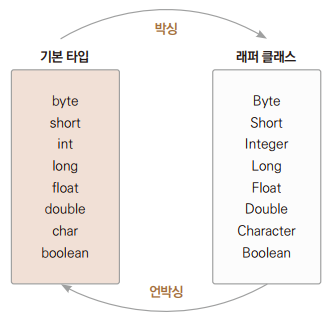

# Chapter17 자바의 기본 클래스

## 1. java.lang 클래스

> java.lang 패키지는 우리가 많이 사용하는 기본 클래스를 포함하는 패키지로 이 패키지에 속한 클래스들은 임포트 하지 않아도 자동을 임포트된다.

| 클래스 | 설명                           |
|-|------------------------------|
| Object | 최상위 클래스로 기본적인 메서드를 제공한다.     |
| String, StringBuffer, StringBuilder | 문자열을 처리하는 메서드를 제공한다.         |
| Number, Integer, Long, Float, Double | 기본형 데이터를 객체화한다.              |
| System | 시스템 정보나 입출력을 처리하는 메서드를 제공한다. |
| Math | 각종 수학 함수를 제공한다.              |
| Thread | 스레드를 처리하는 메서드를 제공한다. |
| Class | 실행 중에 클래스 정보를 제공한다. |

> - JDK가 설치된 폴더의 하위 폴더인 lib 폴더에 보면 src.zip 파일이 있다.
> - 파일 안에 java.lang 패키지 안에 들어 있는 클래스들을 확인할 수 있다.

<br>
<br>

## 2. Object 클래스

> - 모든 자바 클래스의 최상위 클래스로, 모든 자바 클래스는 Object 클래스로부터 상속을 받는다.
> - 컴파일 과정에서 extends Object가 자동으로 사용된다.


| 메서드 | 설명 |
|-|-|
| public String toString() | 객체의 문자 정보를 반환한다. |
| public boolean equals(Object obj) | 두 객체가 동일한지 여부를 반환한다. |
| public int hascode() | 객체의 해시 코드를 반환한다. |
| protected Object clone() | 객체의 사본을 생성한다. |

> Object 클래스의 메서드 중에서는 재정의할 수 있는 메서드도 있고, 그렇지 않은 메서드도 있다.

<br>

### 2.1 toString() 메서드

> Object 클래스에 정의되어 있는 toString() 메서드의 원형

```
public String toString() {
    return getClass().getName() + "@" + Integer.toHexString(hasCode());
}
```
> - 생성된 객체의 클래스명과 해시 코드를 보여준다.
> - 이 메서드는 메서드의 원형 그대로 사용하는 것은 의미가 없고, 보통은 객체 정보를 String으로 바꿔서 사용할 때 많이 사용된다.
> - String 클래스에는 이미 오버라이딩하여 재정의를 해놓고 있다.
>   - 클래스명과 해시 코드를 보여주는 대신 안에 들어 있는 문자열의 내용을 반환한다.

<br>

#### 예제: Ex01_ToString1
> System.out.println() 메서드는 매개변수로 들어오는 객체의 toString() 메서드를 내부적으로 호출해서 반환하는 값을 출력한다.

<br>

#### 예제: Ex02_ToString2
> System.out.println() 메서드는 객체 자체가 매개변수로 주어졌기 때문에 객체 안의 toString() 메서드를 찾는다.
> - 재정의된 메서드가 아니고 상속받은 그대로의 원형이 있기 때문에 클래스명과 해시 코드가 출력된다.

<br>

#### 예제: Ex03_ToString3
> Object 객체의 toString() 메서드를 오버라이딩으로 재정의하여 클래스명@해시코드 대신 그 안의 author 변수의 값을 출력한다.

<br>

### 2.2 equals() 메서드

> Object 클래스에 정의되어 있는 equals() 메서드의 원형

```
public boolean equals(Object obj) {
    return (thos == obj);
}
```
> - 참조하고 있는 변수의 id(주소값)끼리 비교가 된다.

<br>

#### 예제: Ex04_Equals1
> equals 메서드가 재정의되어 있지 않기 때문에 Object 메서드에서 상속받은 그대로 사용하게 된다.

<br>

#### 예제: Ex05_Equals2
> Object 클래스의 equals() 메서드를 오버라이딩하여 객체의 주소를 비교하는 것이 아닌 객체 안에 들어 있는 String 변수의 값을 비교하여 그 결과를 반환한다.

<br>
<br>

## 3. 래퍼 클래스
> 래퍼 클래스(wrapper class)란 기본 자료형에 대해서 객체로서 인식되도록 '포장'했다는 뜻이다.
> - 기본 데이터형(정수형, 문자형, 논리형)에 대응하는 클래스

<br>

> 기본형과 래퍼 클래스

| 메서드 | 설명 |
|-|-|
| boolean | Boolean |
| byte | Byte |
| char | Character |
| short | Short |
| int | Integer |
| long | Long |
| float | Float |
| double | Double |

> 기본 자료형 대신 래퍼 클래스를 사용하는 이유
> - 클래스가 제공하는 편리한 메서드 사용(값 변환, 형변환, 진법 변환)
> - 클래스가 제공하는 상수 사용(MIN_VALUE, MAX_VALUE)
> - 메서드 매개변수의 형이 Object여서 기본 자료형을 사용 못하고 클래스 형태인 래퍼로 넘겨야 할 때 사용(컬렉션 프레임워크)

<br>

### 3.1 Number 클래스
> - java.lang.Number 클래스는 모든 수치형 래퍼 클래스가 상속하는 추상 클래스이다.
> - Number 클래스를 상속한 래퍼 클래스는 추상 메서드가 다 구현이 되어 있다.
>   - byteValue()
>   - shortValue()
>   - intValue()
>   - longValue()
>   - floatValue()
> - 래퍼 객체에 저장된 값을 원하는 기본 자료형 값으로 변환할 수 있다.

#### 예제: Ex06_Number

<br>

### 3.2 문자열 변환

| 클래스     | 메서드           | 기능                |
|---------|---------------|-------------------|
| Byte    | parseByte()   | 문자형을 byte형으로 변환   |
| Short   | parseShort()  | 문자형을 short형으로 변환  |
| Integer | parseInt()    | 문자형을 int형으로 변환    |
| Long    | parseLong()   | 문자형을 long형으로 변환   |
| Float   | parseFloat()  | 문자형을 float형으로 변환  |
| Double  | parseDouble() | 문자형을 double형으로 변환 |

#### 예제: Ex07_parseXXX

> parse는 스태틱 메서드이다.

<br>

### 3.3 오브젝트의 비교

> - 래퍼 클래스의 오브젝트끼리 비교하려면 == 대신에 equals() 메서드를 사용해야 한다.
> - 모든 래퍼 클래스의 equals() 메서드는 객체 안의 기본형 데이터를 비교하는 것으로 메서드의 기능이 재정의되어 있다.

```
Integer a = new Integer(10);
Integer b = new Integer(20);
boolean c = a.equals(b);
```

<br>

### 3.4 다양한 static 메서드들

#### 예제: Ex08_UtilMethod

<br>

### 3.5 박싱과 언박싱

> 박싱은 인스턴스 생성으로 이뤄지지만 언박싱은 래퍼 클래스에 정의된 메서드를 호출해 이뤄진다.



> - 래퍼 객체들은 담고 있는 값을 수정하지 못한다.

#### 예제: Ex09_BoxingUnboxing

```
// 박싱
Integer iObj = Integer.valueOf(10);
Double dObj = Double.valueOf(3.14);

// 메서드 호출을 통한 언박싱
int num1 = iObj.intValue();
double num2 = dObj.doubleValue();
```
<br>

### 3.6 오토박싱과 오토언박싱

#### 예제: Ex10_AutoBoxingUnboxing1, Ex11_AutoBoxingUnboxing2

<br>
<br>

## 4. Math 클래스

> - Math 클래스에 정의된 메서드는 모두 static으로 선언되어 있다.
> - 즉, Math는 기능 제공이 목적일 뿐, 인스턴스 생성을 목적으로 정의된 클래스는 아니다.

### 예제: Ex12_MathUse

<br>
<br>

## 5. Random 클래스

```
Random rand = new Random();
```

```
public boolean nextBoolean() // boolean형 난수 반환
public int nextInt() // int형 난수 반환
public long nextLong() // long형 난수 반환
public int nextInt(int bound) // 0 이상 bound 미만 범위의 int형 난수 반환
public float nextFloat() // 0.0 이상 1.0 미만의 float형 난수 반환
public double nextDouble() // 0.0 이상 1.0 미만의 double형 난수 반환
```

> 임의의 수를 얻는 데 사용하는 클래스이지만 발표 등에서 준비한 자료와 같은 값을 얻기 위해서 생성자에 시드값을 지정해줄 수도 있다.
> - 이 경우 랜덤값이 매번 같은 순서로 나온다.

### 예제: Ex13_RandomUse

<br>
<br>

## 6. Arrays 클래스

### 6.1 객체 저장 배열의 비교

> 배열의 비교는 두 배열에 저장된 데이터 수, 순서, 내용 모두가 같을 때 true를 반환한다.

#### 예제: Ex14_ArrayObjEquals1
> 객체의 내용이 아닌 참조값이 비교되었기 때문에 결과는 false다.

<br>

#### 예제: Ex15_ArrayObjEquals2
> 내용이 같은 것을 체크하려고 배열에 저장된 객체에 Object 클래스로부터 상속받은 equals() 메서드를 오버라이딩으로 재정의했다.

<br>

### 6.2 객체 저장 배열의 정렬

#### 예제: Ex16_ArrayObjSort