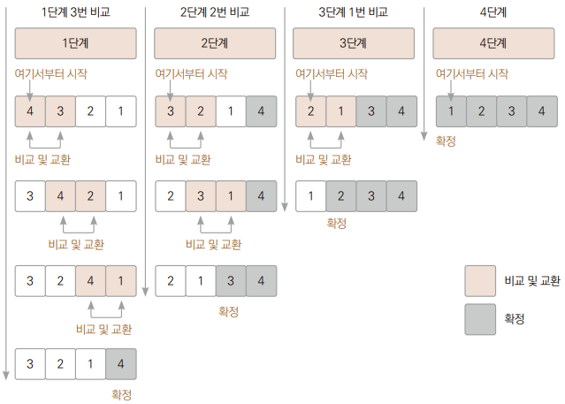
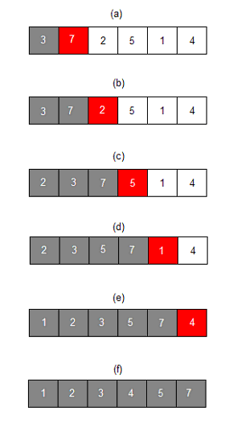

# Chapter08 정렬 알고리즘 만들기

## 1. 프로젝트 목적
> 버블 정렬과 삽입 정렬 알고리즘을 구현한다.

### 1.1 버블 정렬
> 서로 인접한 두 원소를 검사하여 정렬하는 알고리즘

> 1. 인접한 요소끼리 비교하여 더 작은 값을 앞으로, 큰 값을 뒤로 저장한다
> 2. 1번 과정을 마지막 원소까지 반복한다.
> 3. 더 이상 자리를 교환하지 않을 때까지 1번 2번을 반복한다.

 

### 1.2 삽입 정렬
> 배열의 모든 요소를 앞에서부터 차례대로 이미 정렬된 배열 부분과 비교하여, 적절한 자신의 위치를 찾아 삽입하는 정렬이다.

> 1. 인덱스 0은 정렬되어 있다고 가정한다. 그래서 현 위치는 인덱스 1부터 시작한다.
> 2. 현 인덱스의 값과 바로 앞 인덱스의 값을 비교하여 더 작은 값을 앞으로, 큰 값을 뒤로 저장한다.
> 3. 2번 과정을 반복하다가 바로 앞에 있는 값이 더 작다면 그대로 반 지라에 위치한다.
> 4. 마지막 인덱스 까지 2번 3번을 반복한다.

 
 

## 2. 프로젝트 의의
> 기본적은 정렬 알고리즘을 공부하며 구현한다.

 

## 3. 프로젝트 구성
> 숫자 10개를 입력받아 입력된 데이터들을 정렬한다.

> - 버블정렬: Ex01_BubbleSort
> - 삽입정렬: Ex02_InsertSort

## 4. 마치며
> - 정렬을 구현했을 때, 알맞은 알고리즘으로 정렬이 되었는지 확인하기 위해 중간중간에 배열을 출력했다.
> - 두 가지의 정렬을 구현해봤으며 각각의 알고리즘을 구현했을 때의 두 정렬의 차이점을 좀 더 알 수 있었다.

 

## 출처
이재환의 자바 프로그래밍 입문