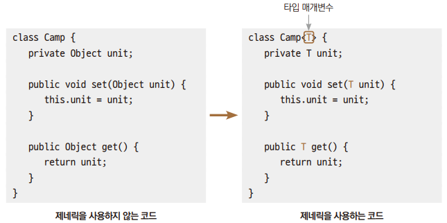
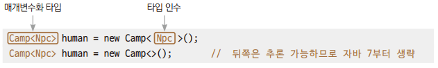
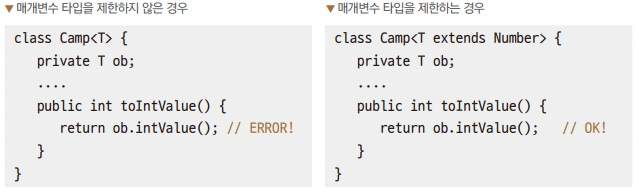
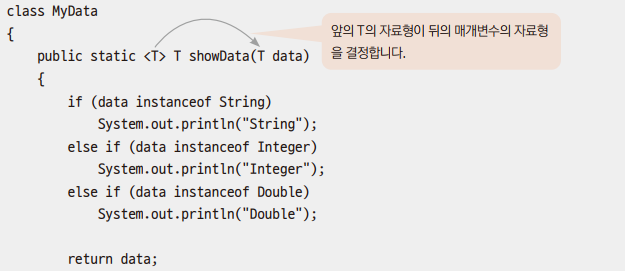

# Chapter20 제네릭

## 1. 제네릭의 필요성

### 예제: Ex01_MyGame1
> 종족을 표현하는 두 클래스의 구조가 똑같으므로 코드가 중복된다는 단점이 있다.

<br>

### 예제: Ex02_MyGame2
> - 자식 클래스의 객체는 부모 클래스형의 변수에 대입할 수 있다.
> - 객체를 꺼내올 때 형변환이 필요하는 불편함이 있지만 코드는 잘 작동된다.
>   - 하지만 이는 컴파일러의 오류 발견 가능성을 낮춘다.

<br>

### 예제: EX03_MyGame3
> - 스트링 객체를 넣었을 때 문법적으로는 오류가 나지 않지만 꺼낼 때 오류가 발생한다.
>   - 프로그래머의 실수가 컴파일 과정에서 발견되지 않는다.

<br>

### 예제: Ex04_MyGame4
> - 에러는 발생하지만 원하는 결과가 아니다.
>   - 실행할 때 에러가 발생하지 않으면 프로그래머는 코드에 이상이 없다고 생각할 수 있다.

> 제네릭을 적용하기 이전의 코드는 객체를 돌려받을 때 형변환을	잊지	말고	해야	한다는 불편함이 있고,
> 코드 진행상 프로그래머가 실수를 해도 그 실수가 드러나지 않을 수도 있다는 잠재적 위험이 존재한다.

<br>
<br>

## 2. 제네릭 기반의 클래스 정의하기

> 제네릭(Generic)이란 클래스, 메서드에서 사용할 자료형을 나중에 확정하는 것이다.
> - 나중에라는 말은 클래스나 메서드를 선언할 때가 아닌 사용할 때, 즉 객체를 생성할 때나 메서드를 호출할 때 정한다는 의미이다.





> - T를 Npc로 결정하여 인스턴스를 생성한다.
> - 따라서 Npc 또는 Npc를 상속하는 하위 클래스의 인스턴스를 저장할 수 있다.

| 용어 | 대상           |
|-|--------------|
| 타입 매개변수(type parameter) | Camp\<T>에서 T |
| 타입 인수(type argument) | Camp\<Npc>에서 Npc |
| 매개변수화 타입(parameterized type) | Camp\<Npc> |

> 타입 매개변수의 이름 규칙(일반적인 관례)
> - 보통 한 문자의 이름을 짓는다.
> - 대문자로 이름을 짓는다.

<table>
    <tr>
        <td>
            E
        </td>
        <td>
            Element
        </td>
    </tr>
    <tr>
        <td>
            K
        </td>
        <td>
            Key
        </td>
    </tr>
    <tr>
        <td>
            N
        </td>
        <td>
            Number
        </td>
    </tr>
    <tr>
        <td>
            T
        </td>
        <td>
            Type
        </td>
    </tr>
    <tr>
        <td>
            V
        </td>
        <td>
            Value
        </td>
    </tr>
</table>

<br>
<br>

## 3. 제네릭 기반의 코드로 개선한 결과

### 예제: Ex05_MyGameGeneric1, Ex06_MyGameGeneric2

> 제네릭을 사용할 시 타입 인수로 지정한 클래스형 외에 다른 형의 객체를 대입할 수 없다.

<br>

### 3.1 제네릭의 장점

> - 중복된 코드의 결합 & 간소화
> - 데이터를 가져올 때 형변환 없이 가져올 수 있음
> - 데이터 대입 시 다른 자료형이 대입되는 것 방지 → 강한 자료형 체크

<br>
<br>

## 4. 매개 변수가 여러 개일 때 제네릭 클래스의 정의

### 예제: Ex07_MultiParameter

> 타입 매개변수는 원하는 형식으로 작성할 수 있다.

<br>
<br>

## 5. 제네릭 클래스의 매개변수 타입 제한하기

```
class Box<T extends Number> { ... }
```
> 상속 관계를 표시하여 매개변수의 타입을 제한할 수 있다.



> - 좌측의 코드는 아무 자료형이나 들어올 수 있기에 래퍼 클래스의 메서드를 호출하면 에러가 발생한다.
> - 우측의 코드는 제네릭에 지정할 수 있는 자료형을 Number를 상속받은 래퍼 타입만으로 한정한다면 intValue() 메서드를 사용할 때 에러 걱정을 할 필요가 없다.

### 예제: Ex08_BoundedCamp

<br>
<br>

## 6. 제네릭 메서드의 정의

> 클래스 전부가 아닌 메서드 하나에 대해서도 제네릭을 정의할 수 있다.

### 예제: Ex09_GenericMethod



```
MyData.<String>showData("Hello World");
```
> 제네릭 메서드의 T는 메서드 호출 시점에 결정된다.

```
MyData.showData(1);  // <Integer>생략
```
> - 타입 인수 생략이 가능하다.
> - 생략된 인수는 매개변수로 들어온 데이터의 자료형으로 추론하게 된다.

