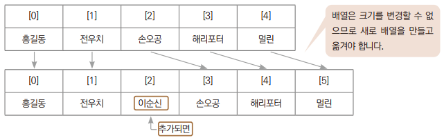
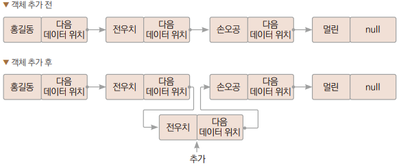

# Chapter21 컬렉션 프레임워크

## 1. 자료구조

> 대량의 데이터를 효율적으로 관리하는 매커니즘
> 자료구조로는 배열, 리스트, 스택, 큐, 트리 등이 있다.


<br>

### 1.1 배열

> 배열은 크기가 고정되어 있어 데이터를 추가하거나 삭제할 수 없다.



<br>

### 1.2 리스트

> 리스트는 원소가 원소를 가리켜서 관리하는 자료구조이다.
> - 데이터가 추가되거나 삭제될 때 연결하는 정보만 바꾸면 쉽게 추가, 삭제가 된다.


<br>

### 1.3 스택

> 스택은 한 쪽 끝에서만 자료를 넣거나 뺼 수 있는 선형 구조(LIFO: Last In First Out)로 되어 있다.
> - 자료를 넣는 것을 푸시(Push), 넣어둔 자료를 빼는 것을 팝(Pop).
> - 가장 최근에 푸시한 자료부터 나오게 된다.


<br>

### 1.4 큐(Queue)

> 큐는 먼저 집어넣은 데이터가 먼저 나오는 FIFO(First In First Out)구조로 저장하는 자료구조
> - 슈퍼마켓 계산대에 줄을 선 손님들의 행렬과 같은 것이라 보면 된다.


<br>

### 1.5 트리 구조

> 트리는 부모 노드 밑에 여러 자식 노드가 연결되고, 자식 노드 각각에 다시 자식 노드가 연결되는 형태의 자료구조
> 부모가 없는 최상위 노드를 루트 노드(root node)라고 한다.


<br>
<br>

## 2. 컬렉션 프레임워크의 구조

> 자바에서는 자료구조를 개발자가 편리하게 사용할 수 있도록 컬렉션 프레임워크를 제공한다.

> 컬렉션 프레임워크에서 제공하는 인터페이스들의 상속 관계


| 인터페이스         | 설명 | 구현 클래스 |
|---------------|-|-|
| List&lt;E&gt; | 순서가 있는 데이터 집합이다.<br>추가된 데이터의 순서도 유지되며, 데이터 중복도 허용된다. | ArrayList, LinkedList |
| Set&lt;E&gt;        | 중복된 데이터가 제거되는 등 추가된 데이터의 순서가 유지되지 않는 데이터의 집합이다.<br> 데이터 중복이 허용되지 않는다. | HashSet, TreeSet |
| Map&lt;K,V&gt;      | 키(Key)와 값(Value)으로 이루어진 데이터들의 집합이다.<br>키는 중복을 허용하지 않지만, 값은 중복될 수 있다.<br>ex) 출석부에 1번 홍길동과 2번 홍길동(동명이인)이 있는 경우 | HashMap, TreeMap |
| Queue&lt;E&gt;      | 순서가 있는 데이터 집합이다.<br>추가된 데이터의 순서도 유지되며, 데이터 중복도 허용된다. | LinkedList |

<br>
<br>

## 3. List&lt;E&gt; 인터페이스를 구현하는 컬렉션 클래스들

> - ArrayList&lt;E&gt; : 배열 기반 자료구조. 배열을 이용하여 객체를 저장한다.
> - LinkedList&lt;E&gt; : 연결 기반 자료구조. 리스트를 구성하여 객체를 저장한다.

> 공통 특성
> - 데이터의 저장 순서가 유지된다.
> - 동일 데이터의 중복 저장을 허용한다.

<br>

### 3.1 ArrayList

#### 예제: Ex01_ArrayList

<br>

### 3.2 LinkedList

#### 예제: Ex02_LinkedList

<br>

### 3.3 ArrayList vs LinkedList

> - ArrayList는 배열은 아니지만 배열 기반이라 데이터의 추가, 삭제보다는 참조가 LinkedList보다 빠르다.
> - LinkedList는 리스트 기반이라 데이터 참조 속도보다는 데이터의 추가, 삭제가 ArrayList보다 쉽다.

> 그래서 만드는 시점에 추가될 데이터 성격을 생각해서 ArrayList나 LinkedList를 선택해서 만들고 사용할 때는 그냥 List로 사용하면 된다.
> - ex) 만들어질 때는 현대차, 기아차처럼 구분이 있지만 차에 타서 운전하는 방법은 똑같다.

| | 장점 | 단점 |
|-|-|-|
| ArrayList&lt;E&gt; | 저장된 객체의 참조가 LinkedList보다 빠르다. | 객체가 추가될 때 저장 공간을 늘리는 과정에서 시간이 비교적 많이 소요된다.<br>객체의 삭제 과정에서 많은 연산이 필요할 수 있어서 느릴 수 있다. |
| LinkedList&lt;E&gt; | 저장 공간을 늘리는 과정이 간단하다. | 저장된 객체의 참조 과정이 배열에 비해 복잡하다. |

<br>

> ArrayList&lt;E&gt;에서 데이터 추가
> - ArrayList.java 파일을 보면, 객체 배열로 사용할 Object 배열과 디폴트 용량이 정의되어 있다.
> - ArrayList() 디폴트 생성자를 호출하여 배열 크기를 지정하지 않으면 크기가 10개짜리 배열이 기본으로 만들어진다.
>> 용량이 부족하면 큰 용량의 배열을 새로 만들고 기존 항목을 복사한다.


> LinkedList&lt;E&gt;에서 데이터 추가
> - 리스트에서 데이터의 추가는 연결 정보만 만들어주면 된다.



<br>

### 3.4 Iterator

> Iterable 인터페이스를 구현했기 때문에 인스턴스의 순차적 접근에 향상된 기능의 for문이나 Iterator 반복문을 이용할 수 있다.

#### 예제: Ex03_IteratorUse

> - iterator() 메서드로 반복자를 구해올 수 있다.
>   - 제네릭으로 자료형이 지정되어 있다.
> - 반복할 수 있는지 hasNext() 메서드로 확인하고 반복이 가능하면 next()메서드로 항목을 가져오게 된다.

<br>

### 3.5 리스트 형식 바꾸기

> 리스트는 배열처럼 선언과 동시에 초기화가 불가능하다.
> - 그러나 Arrays 클래스의 유틸 메서드를 사용하여 다음과 같이 사용할 수 있다.

```
List<String> list = Arrays.asList("홍길동", "전우치", "손오공, "전우치");
```
> - 인수로 전달된 객체들을 저장한 컬렉션 객체를 생성 및 반환한다.
> - 이렇게 생성된 리스트 객체는 객체에 요소를 추가하거나 삭제할 수 없는 객체이다.

> 수정을 하기 위해서는 다시 생성해야한다.

```
List<String> list = Arrays.asList("홍길동", "전우치", "손오공, "전우치");
list = new ArrayList<>(list);
```

> 사용 중에도 데이터 성격을 바꿀 수 있다.

```
List<String> list = Arrays.asList("홍길동", "전우치", "손오공, "전우치");
list = new ArrayList<>(list);
lst = new LinkedList<>(list);
```

<br>

#### 예제: Ex04_Convert

<br>

### 3.6 컬렉션 프레임워크에 기본 자료형을 데이터로 사용하기

> - 컬렉션 프레임워크는 제네릭을 사용하여 자료형을 제한한다.
> - 제네릭 부분에 클래스 타입을 지정해주어야 하며, 기본 자료형을 직접 적어줄 수는 없다.

```
List<Integer> list = new LinkedList<>(); // O
List<Int> list = new LinkedList<>(); // X
```

> 하지만 래퍼 클래스들은 오토 박싱과 오토 언박싱이 되기 때문에 자료형만 래퍼 클래스로 적어줄 뿐 기본 자료형을 사용하는 데 제약사항은 없다.

#### 예제: Ex05_PrimitiveData

> - 데이터를 추가할 때 오토 박싱이 일어난다.
>   - int → Interger
> - 데이터를 꺼내올 때 오토 언박싱이 일어난다.
>   - Integer → int

<br>
<br>

## 4. Set&lt;E&gt; 인터페이스를 구현하는 컬렉션 클래스들

> - 저장 순서가 유지되지 않는다.
> - 데이터 중복 저장을 허용하지 않는다.

### 4.1 HashSet

#### 예제: Ex06_Set

<br>

### 4.2 hash와 hashCode() 메서드

> 해시는 정보를 저장하거나 검색할 때 사용하는 알고리즘이다.

> - 분류 대상: 1, 2, 3, 4, 5, 6
> - 적용 해시 알고리즘: num % 3


> 적용한 해시 알고리즘이 더 많은 분류를 만들어낼 수 있다면 탐색 속도도 빨라진다.

> Object 클래스의 hashCode 메서드는 이렇듯 객체들을 분류하는 역할을 한다.
> - HashSet에서 중복 저장을 막으려면 hashCode() 메서드에서 반환하는 해시 코드값에 해당하는 내부 목록을 찾는다.

<br>

### 4.3 HashSet의 중복 비교

> hashCode() 메서드는 직접 만들 수도 있지만, 자바에서 제공하는 메서드를 이용하여 쉽게 만들 수 있다.

```
public int hashCode(){
    return java.util.Objects.hash(가변 인수);
}
```

#### 예제: Ex07_HashSetEqual

> - hashCode() 메서드를 오버라이딩하여 숫자만 비교한다.
> - 탐색의 단계에서 해시코드가 같고, 그 다음 equals() 메서드로 name이 다를지라도 같은 나머지로 중복된 데이터라고 판단하게 된다.
> - HashSet에는 추가가 되지 않는다.

> 주석된 hashCode()를 실행하면 추가한 데이터의 모든 해시값이 다르게 되므로 equals() 메서드가 호출되지 않고 서로 다른 객체로 처리된다.

<br>

### 4.4 TreeSet

> 컬렉션 프레임워크에서 Tree로 시작하는 클래스는 데이터를 추가한 후 결과를 출력하면 결괏값이 정렬된다.
> - TreeSet은 자료의 중복을 허용하지 않으면서 출력값을 정렬하는 클래스

#### 예제: Ex08_TreeSet

> 반복자의 객체 참조 순서는 오름차순을 기준으로 한다.

<br>

### 4.5 TreeSet의 정렬

> 자바는 TreeSet의 정렬을 구현하기 위해 이진 탐색 트리(BST: Binary Search Tree)를 사용한다.

> - 트리 자료구조에서 각 자료에 들어가는 공간을 노드(Node)라고 한다.
> - 위아래로 연결된 노드의 관계를 '부모-자식 노드(parent-child node)'라고 한다.
> - 이진 탐색 트리는 노드에 저장되는 자료의 중복을 허용하지 않고, 부모가 가지는 자식 노드 수가 2개 이하다.


> - 각 노드의 왼쪽 서브 트리에는 해당 노드의 값보다 작은 값을 지닌 노드들로 이루어져 있다.
> - 각 노드의 오른쪽 서브 트리에는 해당 노드의 값보다 큰 값을 지닌 노드들로 이루어져 있다.
> - 중복된 노드가 없어야 한다.
> - 왼쪽 서브 트리, 오른쪽 서브 트리 또한 이진 탐색 트리다.
>> 비교 범위가 1/2 만큼씩 줄어들어 효과적으로 자료를 검색할 수 있다.


> 맨 왼쪽 노드부터 시작해서 왼쪽 → 부모 → 오른쪽(뭉치) 순으로 순회하면 오름차순이 된다.
> - 1 → 2 → 오른쪽 뭉치 → 3 → 4 → 5 → 올라감 → 6 → 7 → 8

<br>

> 컬렉션 프레임워크에서는 Comparable 인터페이스에 제네릭을 적용한 인터페이스를 구현해주면 된다.

```
interface Comparable<T>
→ int compareTo<T o>
```

> - 인수가 전달된 o가 작다면 양의 정수 반환
> - 인수가 전달된 o가 크다면 음의 정수 반환
> - 인수가 전달된 o와 같다면 0을 반환

<br>

> - Comparable&lt;T&gt; 인터페이스의 구현 결과를 근거로 객체의 크기 비교가 이루어진다.
> - TreeSet&lt;T&gt;에 저장할 객체들은 모두 Comparable<T> 인터페이스를 반드시 구현한 클래스의 객체여야 한다.
>   - 아니면 예외가 발생한다.

```
class Student implements Comparable<Student> {
    private String name;
    private int age;
    ...
    public int compareTo(Student s) {
        return this.age - s.age;
    }
}
```


#### 예제: Ex09_Comparable

> TreeSet에 객체를 저장하려면 Comparable&lt;T&gt; 인터페이스가 반드시 구현되어있어야 한다.

<br>

### 4.6 Comparator&lt;T&gt; 인터페이스

> - Comparator&lt;T&gt;는 정렬을 구현하는 데 사용하는 인터페이스로 compare() 메서드를 구현해야 한다.
> - 기존 클래스가 Comparable&lt;T&gt; 인터페이스를 구현하여 이미 정렬 조건이 있다고 하더라도 새로운 정렬을 주고 싶을 때 사용할 수 있다.

#### 예제: Ex10_Comparator

<br>

### 4.7 응용: 중복된 객체 삭제

#### 예제: Ex11_ConvertExt

<br>
<br>

## 5. Queue&lt;E&gt; 인터페이스를 구현하는 컬렉션 클래스들


### 5.1 Queue의 구현

> LinkedList&lt;E&gt;는 List&lt;E&gt;와 동시에 Queue&lt;E&gt;를 구현하는 컬렉션 클래스이다.
> - 따라서 어떠한 타입의 참조 변수로 참조하느냐에 따라 '리스트'도 '큐'도 될 수 있다.

#### 예제: Ex12_Queue

```
Queue<String> que = new LinkedList<>();

que.size() // 큐의 크기
que.peek() // 다음에 나올 객체 확인
que.poll() // 객체 꺼내기
```

<br>

### 5.2 Stack의 구현

> 자바는 Deque를 기준으로 스택을 구현한다.
> - 양쪽 끝에서 삽입과 삭제가 모두 가능한 자료 구조의 한 형태
```
Deque<String> deq = new ArrayDeque<>();
Deque<String> deq = new LinkedList<>();
```

> 다만 Deque를 이용하면 메서드를 사용하는 방법에 따라 자료구조를 큐처럼 사용할 수도 있고, 스택처럼 사용할 수도 있다.


#### 예제: Ex13_Deque

<br>
<br>

## 6. Map&lt;K, V&gt; 인터페이스를 구현하는 컬렉션 클래스들

> Map 인터페이스에는 Key-Value 방식의 데이터를 관리하는 데 필요한 메서드가 정의되어 있다.
> - 객체의 key값은 유일하며 value값은 중복될 수 있다.

> - HashMap 클래스 : 내부적으로 해시 알고리즘에 의해 구현되어 있다.
> - TreeMap 클래스 : TreeSet과 마찬가지로 이진 탐색 트리로 구현되어 있다. key값으로 정렬하므로 key값에 해당하는 클래스에 Comparable이나 Comparator 인터페이스가 구현되어 있어야 한다.

<br>

### 6.1 HashMap&lt;K, V&gt;클래스

#### 예제: Ex14_HashMap

```
HashMap<String, String> map = new HashMap<>();

map.put("손오공", "010-6543-6543"); // key-value 추가
map.get("손오공"); // key값으로 value값 찾기
map.remove("손오공"); // 데이터 삭제
```

<br>

### 6.2 HashMap&lt;K, V&gt;의 순차적 접근 방법

> - HashMap&lt;K, V&gt; 클래스는 Iterable&lt;T&gt; 인터페이스를 구현하지 않았기에 향상된 기능의 for문을 통해서, 또는 '반복자'를 얻어서 순차적 접근을 할 수 없다.
> - 대신 keySet() 메서드 호출을 통해서 Key를 따로 모아놓은 컬렉션 객체를 얻을 수 있다.
>   - 이때 반환된 컬렉션 객체 대상으로 반복자를 얻을 수 있다.

#### 예제: Ex15_HashMapKeySet

<br>

### 6.3 TreeMap&lt;K, V&gt;의 순차적 접근 예
> - TreeMap&lt;K, V&gt; 클래스는 Iterable&lt;T&gt; 인터페이스를 구현하지 않았지만, keySet() 메서드 호출을 통해서 Key를 따로 모아놓은 컬렉션 객체를 얻어서 순차적 접근을 할 수 있다.

#### 에제: Ex16_TreeMapKeySet

> TreeMap의 성격상 key들이 정렬되어 있다.

<br>
<br>

## 7. 컬렉션 기반 알고리즘

### 7.1 정렬

> List&lt;E&gt;를 구현한 컬렉션 클래스들은 저장된 객체를 정렬된 상태로 유지하지 않고 입력된 순서대로 유지하고 있다.
> - 정렬을 해야 한다면 Collection.sort() 메서드를 사용할 수 있다.
> - 객체 크기를 비교해야 정렬할 수 있으므로 객체의 클래스는 Comparable&lt;T&gt; 인터페이스를 구현한 상태여야 한다.

#### 예제: Ex17_CollectionsSort

> String 클래스는 Comparable 인터페이스를 구현한 상태이므로 바로 쓸 수 있다.

<br>

> 해당 객체의 Comparable 인터페이스 구현에 의한 정렬뿐 아니라 다른 정렬 방법을 제공할 수도 있다.
> - 이때도 Comparator 인터페이스를 구현한 객체를 사용할 수 있다.

#### 예제: Ex18_CollectionsSort2

<br>

### 7.2 검색

> 이진 탐색 기능을 이용하여 리스트 안에 데이터가 있는지 확인할 수 있다.
> - 이진 탐색을 이용하려면 데이터가 먼저 정렬되어 있어야 한다.

#### 예제: Ex19_CollectionsSearch

> Collections.binarySearch() 메서드에 의해 데이터가 검색되지 않으면 음수를 반환한다.

<br>

### 7.3 복사

#### 예제: Ex20_CollectionsCopy