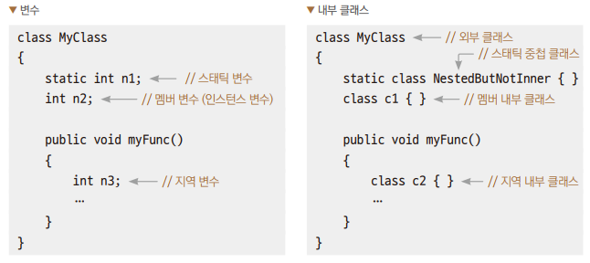
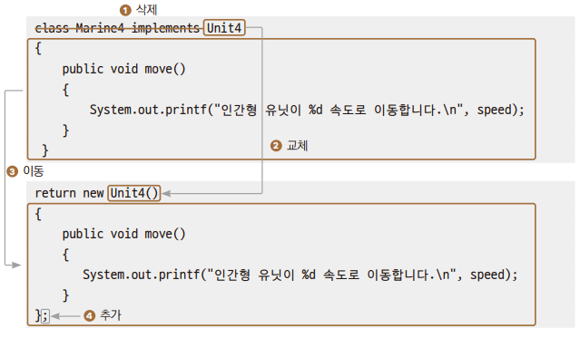
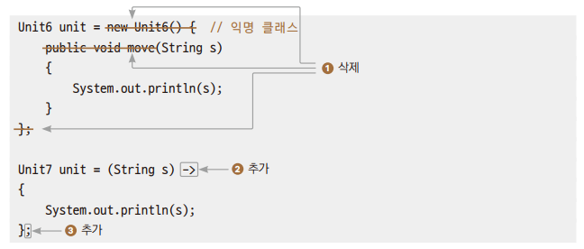

# Chapter22 내부클래스, 람다식

## 1. 내부 클래스

> 자바에서는 클래스안에 클래스를 선언할 수가 있다.
> - 중첩 클래스(nested class): 안쪽에 있는 클래스
> - 외부 클래스(outer class): 중첩 클래스를 가지고 있는 클래스

> 중첩 클래스의 구분
> - 스태틱 중첩 클래스: 중첩이지만 내부 클래스는 아니다.
> - 논스태틱 중첩 클래스: 내부 클래스(inner class)
>   - 멤버 내부 클래스(member inner class)
>   - 지역 내부 클래스(local inner class)
>   - 익명 내부 클래스(anonymous inner class)



<br>
<br>

## 2. 멤버 내부 클래스

> - 다른 클래스와는 연관되어 사용되지 않고 해당 클래스에만 특정 클래스를 사용할 때 하나의 소스 파일을 묶어 관리를 편하게 할 수 있다.
> - 외부 클래스는 내부 클래스를 멤버 변수처럼 사용할 수 있고, 내부 클래스는 외부 클래스의 자원을 자원을 직접 사용할 수 있다.

```
외부클래스.new 내부클래스생성자();
```

### 예제: Ex01_MemberInner

> - 내부 클래스는 멤버 메서드처럼 외부 클래스의 자원을 그대로 사용할 수 있다.
> - 내부 클래스는 외부 클래스를 이용해 객체를 먼저 만들고 그 객체를 참조하여야만 만들 수 있다.

<br>
<br>

## 3. 지역 내부 클래스

> 지역 내부 클래스는 클래스의 정의 위치가 메서드, if문, while문 같은 중괄호 블록 안에 정의된다는 점에서 멤버 내부 클래스와 구분된다.
> - 해당 메서드 안에서만 객체 생성이 가능해지므로 클래스의 정의를 깊이 숨기는 효과가 있다.

### 예제: Ex02_LocalInner

<br>
<br>

## 4. 익명 내부 클래스

> - 지역 내부 클래스는 해당 메서드에서만 클래스 생성이 가능하므로 클래스명이 상당히 제한적으로 사용된다.
> - 그래서 클래스명을 생략해 버리기도 하는데, 이렇게 클래스명을 생략한 것이 익명 내부 클래스다.

### 예제: Ex03_AnonoymousInner1

> 클래스명을 생략할 때 일단 이름이 없으므로 부모 클래스나 인터페이스의 이름을 임시로 사용한다.



### 예제: Ex04_AnonymouseInner2

```
return new Unit4() {
            public void move() {
                System.out.printf("인간형 유닛이 %d속도로 이동한다.\n", speed);
            }
        };
```

> 하나의 실행문이므로 세미콜론으로 끝난다.

<br>
<br>

## 5. 람다식

> - 만약 어떤 기능이 필요한데 간단한 기능이기 때문에 함수만 하나 만들어서 사용하고 싶어도, 자바는 클래스 기반의 객체지향 언어이기 때문에 간단한 클래스를 만들어줘야 한다.
> - 클래스를 먼저 만들고, 클래스 안에 기능을 구현한 메서드를 만든 후 객체를 통해 그 메서드를 호출해야 한다.
>> 이러한 불편함을 덜기 위해서 자바 8부터는 함수형 프로그래밍 기법인 람다식(lambda expression)을 지원한다.

<br>

### 5.1 익명 내부 클래스 → 람다식

#### 예제: Ex05_Lambda1

> 기능 하나만 원할 뿐인데 객체까지 만들어야 해서 불편하다.

#### 예제: Ex06_Lambda2

> 중괄호 블록의 코드로 익명 내부 클래스를 구현해준다.

> 예제2를 람다식으로 변환
> 1. 익명 클래스를 나타내는 의미 없이 붙인 이름과 외부의 중괄호를 제거한다.
> 2. 함수 이름, 변환형을 없애고 화살표( -> )를 추가한다.
> 3. 함수의 실행문 { } 블록을 남기고 문장의 끝을 알려주기 위해 세미콜론으로 마지막을 표시한다.



#### 예제: Ex07_Lambda3

> - 람다식을 인터페이스형의 변수에 대입했다.
> - 인터페이스의 메서드는 무조건 구현을 해줘야 하는 것이기에 람다식이 인터페이스의 메서드에 할당된다.

<br>

### 5.2 람다식 문법

> 매개변수가 하나면 자료형과 소괄호를 생략할 수 있다.

```
str -> { System.out.println(str); }
```

> 중괄호 안의 구현부가 한 문장이면 중괄호를 생략할 수 있다.

```
str -> System.out.println(str);
```

#### 예제: Ch22_Ex08_LambdaRule1

> 중괄호 안의 구현부가 한 문장이라도 return문이 있다면 중괄호를 생략할 수 없다.

```
str -> return str.length(); // X
```

> 매개변수가 두 개 이상이면 소괄호를 생략할 수 없다.

```
x, y -> { System.out.println(x + y); }; // X
```

> 중괄호 안의 구현부가 반환문 하나라면 return과 중괄호 모두 생략할 수 있다.

```
str -> str.length() // 문자열의 길이 반환함
(x + y) -> x + y; // 두 값을 더하여 반환함
```

#### 예제: Ex09_LambdaRule2

#### 예제: Ex10_LambdaRule3

> 매개변수가 없는 경우에는 소괄호를 생략할 수 없다.

```
( ) -> System.out.println("Hello");
```

<br>
<br>

## 6. 함수형 인터페이스

> - 함수형 인터페이스는 람다식을 선언하는 전용 인터페이스이다.
> - 함수형 인터페이스는 익명 함수와 매개변수만으로 구현되므로 단 하나의 메서드만을 가져야 한다.
>   - 만약 두 개 이상의 메서드가 있게 된다면 어떤 메서드에 익명 함수를 대입할지 모호해지기 때문에 에러가 발생한다.
> - @FunctionalInterface

### 예제: Ex11_Functional

<br>
<hr>

## 출처
이재환의 자바 프로그래밍 입문